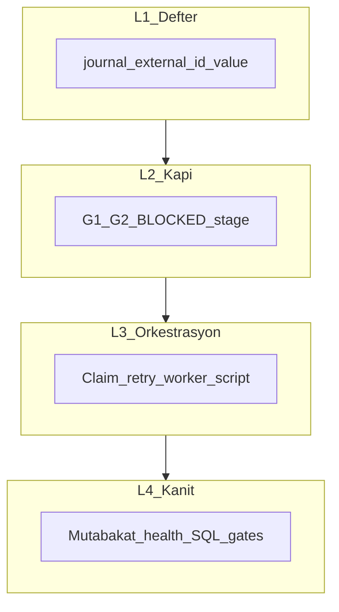
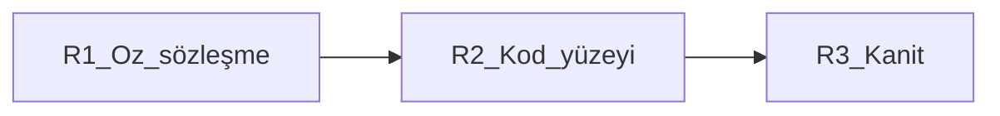
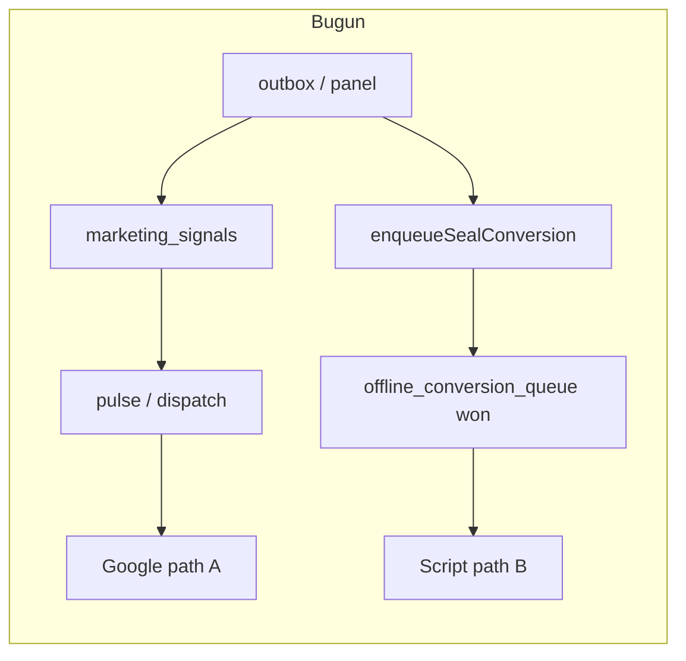
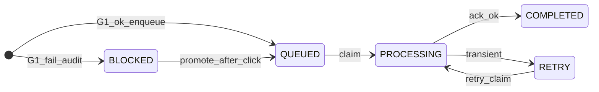

# Kapalı sistem — deep-katı export journal (formal tasarım)

## 0) Terim sözlüğü (tartışma yok)

| Terim | Sabit anlam |
|--------|----------------|
| **Export journal** | `offline_conversion_queue` — Google’a gidecek veya **BLOCKED** ile kasıtlı bloke edilen tüm tekil dönüşüm satırları. |
| **Upload** | Google Ads API veya Script Upload ile dış dünyaya **bir kez** (idempotent) giden işlem. |
| **Sessiz düşme** | Hata/eksik koşul loglanmadan veya row oluşturulmadan geçiş — **strict modda FORBIDDEN**. |
| **Strict mode** | Ortam flag’i (ör. `OCI_EXPORT_STRICT=1`) — HARD STOP + invariant’lar zorunlu. |
| **Gclid’li intent** | Lead (`calls` + `sessions`) üzerinde **G1** sağlanmış: trim’li `gclid` \| `wbraid` \| `gbraid` en az biri (session veya çağrı birleşik çözümleme ile). |
| **4 dönüşüm** | Kanon isimler: [`lib/oci/conversion-names.ts`](lib/oci/conversion-names.ts) — `junk` → **OpsMantik_Junk_Exclusion**, `contacted` → **OpsMantik_Contacted**, `offered` → **OpsMantik_Offered**, `won` → **OpsMantik_Won**. |
| **Derin determinizm** | Aynı **yayımlanmış kanon girdi kümesi** → aynı **journal kimliği** (`external_id`) ve aynı **idempotent sonuç**; nondeterministik süreçler **kimlik/value** yolunda **yasak** (yalnızca ayrılmış “scheduling” bandında tolerans). |
| **Dört derin katman (L1–L4)** | Üst üste **yığın**: **L1 Defter** (journal + `external_id`) → **L2 Kapı/Politika** (G1/G2, BLOCKED, stage) → **L3 Orkestrasyon** (claim, retry, worker/script) → **L4 Gözle/Kanıt** (mutabakat, health SQL, release gates). Alt katman **matematiksel**; üst katman **yalnızca** altın izin verdiği belirsizliği taşır. |
| **Dört derin kesen yüzey (W1–W4)** | Yığına **dik** enine eksen: aynı “deep” kuralı **tenant**, **zaman**, **yüzey** (API vs script), **ekonomi** boyutunda **tekrarlanmadan çelişmez** şekilde uygulanır ([§0c](#0c-dört-derin-kesen-yüzey-w1w4--enine-matris)). |
| **Üçlü derinlik (R1–R3)** | **Öz** (donmuş sözleşme) → **Kod** (tek yazım yüzeyi) → **Kanıt** (test + SQL + gates) zinciri; “deep deep deep” = üç halka **birlikte** ship şartı ([§0d](#0d-üçlü-derinlik-r1r3--öz--kod--kanıt)). |
| **Meta-derinlik (M1–M5)** | Plana **dizilmiş** L/D/W/R/I sonrası, **isteğe bağlı** ince ayar seviyeleri — çoğu ek ekip/araç maliyeti; [§11](#11-daha-derin-olabilir-mi-m1m5--isteğe-bağlı) |

---

## 0a) Derin determinizm (D1..D11) — formal

**Amaç:** “Deep ×4” = yalnızca tuple tekrarı değil: **patlama sınırı**, **yan etkisiz orkestrasyon**, **yalanlanabilir (falsifiable) RED** — şans ve wall-clock **L1–L2** yoluna **sızmasın**; **L3**’te tek kontrollü istisna = scheduling bandı.

| ID | Kural | Not |
|----|--------|-----|
| **D1** | `external_id` **saf fonksiyon**: `computeOfflineConversionExternalId({ providerKey, action, saleId?, callId?, sessionId? })` ([`lib/oci/external-id.ts`](lib/oci/external-id.ts)) — **random/time yok** | Aynı tuple → aynı hash öneki |
| **D2** | `value_cents` / stage ekonomisi **aynı policy sürümü + aynı snapshot girdileri** → aynı sayısal sonuç ([value SSOT](lib/oci/marketing-signal-value-ssot.ts)) | Şema sürümü drift = deploy STOP (I8) |
| **D3** | **Transition / seal / ACK** zaman damgaları: sözleşmede **DB otoritesi** (`getDbNowIso` vb.) — **wall-clock tek başına** yasaklanmış yüzeyler listelenir ve testlenir | Zaman SSOT = G3 |
| **D4** | **Replay / idempotency**: Aynı outbox veya aynı `(site_id, external_id)` ile **yeniden çağrı** → ikinci yazım ya **23505 no-op** ya da **deterministik replay cevabı** (ACK hash) | I6 ile uyum |
| **D5** | **Mutabakat ve tarama sıraları** sabit: `ORDER BY` + tie-break (ör. `call_id`, `action`, `created_at`) — “ilk gelen kazanır” belirsizliği yok | SQL + worker aynı sıra semantiği |
| **D6** | **JSON/hash** ile çalışan yollar (marketing_signal hash vb.) — serileştirme **stabil** (anahtar sırası, normalization); kripto hash üzerinde **map iteration order** bağımlılığı yasak | G4 ile uyum |
| **D7** | **Jitter / backoff** (`next_retry_at`): **yalnız** `OCI_RETRY_JITTER_*` bandında; **claim sırası**, **external_id**, **upload payload** üretimine **karışmaz** | Kimlikten ayrı “scheduling ayrımı” |
| **D8 (blast)** | **Orkestrasyon hatası** (worker çökme, claim timeout, DLQ) **L1 kimliğini bozmaz**: `external_id` / satır birincil anahtar kuralları **scheduler’dan bağımsız** | Zehirli hap recovery ≠ kimlik yeniden icat |
| **D9 (monotonik görünüm)** | “Stage fired” veya journal append olguları **mutabakat görünümünde** geri **silinmez**; geri alma **explicit reversal / junk satırı** ile modellenir (sessiz history rewrite yok) | STRICT audit ile uyum |
| **D10 (causal pin)** | Her **COMPLETED** veya **BLOCKED terminal** satır, üretim zincirinde **en az bir** izlenebilir kök bağlar: `call_id` / outbox id / `correlation_id` politikası — **hayalet tamamlanma** yok | SRE kök neden |
| **D11 (evidence pin)** | Release **RED** veya closure kanıtı **yeniden üretilebilir**: repo SHA, migration head, contract sürümü (`CLOSED_SYSTEM_SCORE_CONTRACT` vb.), örnek SQL fixture — “sadece prod’da kırmızı” yasak | `evidence-contracts` / gates |

**İstisna (bilinçli nondeterminizm):** Yalnızca **retry zamanlaması** (thundering herd kırma) — üstte ayrılmış; strict audit’te “scheduler entropy” **dış rapor**.

**Test zorunluluğu:** Aynı fixture ile **iki kez** `enqueue*` → aynı `external_id`; aynı ACK replay → aynı sonuç; mutabakat iki çalıştırma → aynı gap seti; **D11** için aynı commit’ten evidence script’i → aynı PASS/FAIL sınıfı.

---

## 0b) Dört derin katman (L1..L4) — “deep^4” yığın

| Katman | Soru | Başarısızlık modu |
|--------|------|-------------------|
| **L1** | Aynı iş için **tek kimlik** ve tutarlı öz mü? | Unique violation / hash drift → **STOP** |
| **L2** | Bu satır **yasal mı** (G1/G2, stage, junk politikası)? | `BLOCKED` veya **emit yok** — **sessiz yok** |
| **L3** | **Ne zaman** ve kaç deneme ile dışa gider? | Yalnızca schedule entropy; L1’i **değiştirmez** |
| **L4** | Sistem **yalan söyleyebilir mi** (yeşil gösterirken gap)? | Gap → **RED**, kanıt paketlenmiş |

**Kural:** Üst katman, alt katmanın **yasaklarıyla çelişen** bir “kolay yol” açamaz (ör. L3’te rastgele `external_id` üretmek — **FORBIDDEN**).

---

## 0c) Dört derin kesen yüzey (W1..W4) — enine matris

**Ne farkı var?** **L** = dikey güven halkaları; **W** = aynı halkaların **her kod yolunda** ve **her müşteri sınırında** tekrar doğrulanması. “Deep^4” ikinci kez: **enine** dört kesit.

| ID | Kesen yüzey | Derinlik sorusu | Örnek bağ |
|----|----------------|------------------|-----------|
| **W1 (tenant)** | **Kiracı sınırı** — `site_id` / org projection hiçbir katmanda **karışmaz**; `external_id` ve queue taramaları **tenant-klamlı** | Tenant migration / RLS sözleşmesi |
| **W2 (time)** | **Zaman tek hikâye** — seal, health, retry damgası aynı **SSOT** semantiği; wall-clock “gizli kolon” değil ([`oci_time_ssot_health.sql`](scripts/sql/oci_time_ssot_health.sql) hattı) | D3 + I8 |
| **W3 (surface)** | **Yüzey eşdeğerliği** — Script upload ile API/dispatch **aynı logical upload** kuralları; çift hat = **W3 ihlali** (Path A/B) | U0, bölüm 2 |
| **W4 (economy)** | **Ekonomi kapalı** — `value_cents`, `google_conversion_name`, stage enum **tek sözlük**; bir yüzey “düzgün” diğeri farklı miktar gönderemez | D2, conversion-names |

**Matris (soyut):** Her hücre \((L_i, W_j)\) için bir **çıktı uygulanabilirlik** sorusu sorulur: örn. “L3 retry, W1 tenant’ta başka site row’una dokunamaz mı?” — cevap **hayır** olmalı. Formal kapı: **I12** (§4).

---

## 0d) Üçlü derinlik (R1..R3) — öz → kod → kanıt

**“Deep deep deep” (×3):** Yapısal derinlik (**L**), kesen yüzey (**W**) ve determinizm (**D**) **yazılmış** ve **kodlanmış** ve **ölçülmüş** olmadan release yok.

| ID | Uç | Soru | Minimum çıktı |
|----|-----|------|----------------|
| **R1** | **Öz** | I/D/L/W **hangi cümleleri** dondurduk; sürüm ve migration ile **çelişiyor mu**? | Tek `ExportClosure` dokümanı + sürüm pimi (D11 ile hizalı) |
| **R2** | **Kod** | R1’deki her “mutlaka journal” cümlesi **tek `enqueue*` yüzeyinden** mi geçiyor; gölge yol (Path A/B) var mı? | Kod haritası: outbox → journal satırı; çift kanal = **W3** altında STOP |
| **R3** | **Kanıt** | R2 gerçekten R1’i mi sağlıyor? | `test:release-gates` + hedef SQL ([`oci_time_ssot_health.sql`](scripts/sql/oci_time_ssot_health.sql) vb.) + özellik/fixture testleri; gap ≠ **yeşil** |

Üçlünün formal kapısı: **I13** (§4).

---

## 1) Ürün kilidi (sıfır tolerans — kapsam)

**Kural K1 (dört dönüşüm, tek journal):** Funnel / outbox / panel bu **dört** `OptimizationStage` için bir olayı **ihbar** ettiğinde (yani ilgili stage “ateşlendi” kabul edildiğinde), sonuç **mutlaka** bir `offline_conversion_queue` satırıdır: doğru `action` / `google_conversion_name` eşlemesi, deterministik `external_id`, SSOT zaman ve ekonomi politikası.

**Kural K2 (G1 sonrası “niyet”):** **Gclid’li intent** (G1 ✓) lead’de, yukarıdaki dört dönüşümden **hangisi iş kurallarına göre tetiklenmişse**, o tetik için **journal satırı yokluğu = operasyonel FAIL** (0 tolerans). *Tetiklenmemiş* stage için satır bekleme — “expected set” mutabakat politikasında tanımlanır (ör. “won olmadan offered beklenmez” gibi).

**Kural K3 (G1 yok):** Tıklama kimliği yoksa Google upload **yasak**; yine de **truth gap sıfır** için [`MISSING_CLICK_ID`](lib/oci/enqueue-seal-conversion.ts) pattern ile **BLOCKED** audit satırı veya ürünün “tetik yok” kilidi — **sessiz boşluk yasak** (U1 ile aynı ruh).

**Kural K4 (G2 rıza):** Marketing consent yoksa → bu org kurallarına göre ya **satır hiç oluşmaz** (stage tetiklenmez) ya da **explicit BLOCKED reason** — sessiz skip yok.

**Kural K5 (junk):** Junk / retraksiyon satırları da **4 kümeye** dahil; negasyon/upload sırası mevcut outbox junk reversal mantığı ile uyumlu, ama **journal tek kaynak** (I5).

---

## 2) Mevcut kırılma yüzeyi (bugün)

**Deep-katı risk:** Aynı mantıksal dönüşüm için **Path A ve Path B** aynı anda yaşayabilir → **çift upload** veya **hash/row çelişkisi** (G4/G5 ihlali).

---

## 3) Hedef: tek yazım yüzeyi + tekil upload kanalı

**Kural U0 (upload tekilliği):** Belirli `(site_id, external_id)` veya politikada tanımlı **logical_key** için **en fazla bir** aktif upload implementasyonu (script XOR dispatch-api XOR başka).

**Kural U1 (journal completeness):** Tetiklenmiş stage × G1/G2 kuralları → ya **yüklenebilir satır** ya da **BLOCKED audit** — satır yokluğu yasak.

**Kural U2 (sessiz yok):** Strict modda her başarısızlık → structured log + `reason_code`.

---

## 4) Formal invariants (I1..I13 + D1..D11 + W1..W4 + R1..R3 köprüsü)

| ID | Invariant | İhlal |
|----|-----------|--------|
| **I1–I8** | (önceki plan ile aynı) | STOP / RED |
| **I9 (four-fire)** | Dört dönüşümden **hangisi** sistemde “fired” sayılıyorsa, o olay için **bir** journal satırı (veya açıkça dokümante BLOCKED) | mutabakat **FAIL** |

**I10 (determinism-bridge):** I1 + **D1..D11** kimlik/value/scheduling-ihlali = **aynı ciddiyette** STOP (determinizm + kapanış release blocker).

**I11 (depth-closure):** **L1–L4** veya **D8–D11** ihlali (patlama, hayalet tamamlanma, kanıtsız RED) = **deploy STOP** — “derin” yalnızca dokümantasyon değil, **ölçülen** sözleşme.

**I12 (cross-cut-closure):** **W1–W4** matrisinde \((L,W)\) **boş hücre / çelişki** (ör. script başka `value_cents` gönderiyor) = **deploy STOP** — “deep^4” **enine** de kilitli.

**I13 (assurance-triple):** **R1–R3** zincirinde kopukluk (öz yazılı değil, kod çift yüzey, kanıt gates’siz) = **deploy STOP** — “deep^3” ship koşulu.

---

## 5) Durum makinesi (özet)

Allow-list transitions; BLOCKED claim yok; promote sadece G1 sonrası.

---

## 6) S1 vs S2

**S1** önerilir: `marketing_signals` → Google doğrudan **kapatılır** (veya salt projection); upload **yalnızca** journal + worker/script.

---

## 7) Sürekli mutabakat

- **Beklenen:** politika tablosu: (site, call_id, stage_fired) → beklenen journal anahtarı.
- **Gerçek:** `offline_conversion_queue` filtreleri.
- **Gap ≠ ∅** → **export_closure_red**, deploy STOP.

---

## 8) Adversarial + evidence (L4 yoğunlaştırma)

Duplicate storm, replay, clock skew; **silent skip yok**. STATIC + TARGET_DB evidence; `npm run test:release-gates`. **D11:** aynı commit’ten **yeniden koşulabilir** PASS/FAIL; migration/contract drift açıkça pin’lenir ([`scripts/release/evidence-contracts.mjs`](scripts/release/evidence-contracts.mjs) hattı ile uyum).

---

## 9) Fazlar

Faz 0: S1 + 4-dönüşüm matrisi + `OCI_EXPORT_STRICT`.  
Faz 0b: I1–I13 + D1–D11 + L1–L4 + W1–W4 + R1–R3 dokümanı.  
Faz 1: `enqueueOciConversionRow` (4 stage).  
Faz 2: DB enforcement.  
Faz 3: outbox tekilleştirme.  
Faz 4: worker/script 4 isim.  
Faz 5: mutabakat + health v2.  
Faz 6: chaos + gates.

---

## 10) Tek cümle

**Gclid’li intent** altında **dört OpsMantik dönüşümü** **L/W/D** ile kilitli; **R1–R3** ile **öz–kod–kanıt** üçlüsü tamamlanmadan **ship yok**; **0 tolerans**, **çift hat yok**, **sessiz boşluk yok**.

---

## 11) Daha derin olabilir mi? (M1..M5) — isteğe bağlı

**Kısa cevap: Evet** — ama **L / D / W / R / I13** zaten operasyonel “derinlik”i **ölçülebilir** şekilde kapatır. Aşağıdakiler **bir üst soyutlama katmanı**; hepsi şart değil, **maliyet–kazanç** ile seçilir.

| ID | Seviye | Ne ekler? | Ne zaman düşünülür? |
|----|--------|-----------|---------------------|
| **M1** | **Biçimsel doğrulama** | TLA+ / model checking / kısıtlı durum uzayı kanıtı — “imkânsız kötü çalıştırma” | Yüksek finans veya regülasyonel **kanıt seviyesi** talebi |
| **M2** | **Teşvik / oyun** | Kötü ölçümün sistemi nasıl bozacağı (Goodhart) — KPI ↔ export bütünlüğü | Ürün veya satış **metrikleri** export ile çakışıyorsa |
| **M3** | **Örgüt + süreç derinliği** | RACI, değişim kurulu, runbook **SLA** (MTTR export RED) | Ekip büyüdükçe; teknikten **ayrı** ama **K/Y**yi etkiler |
| **M4** | **Dağıtık derinlik** | Çok bölge, **split-brain**, çoğaltma lag’i altında journal tekilliği | Coğrafi HA istendiğinde — bugünkü **tek DB SSOT** sözleşmesini **genişletir** |
| **M5** | **Kriptografik kanıt** | İmzalı evidence bundle (geliş audit), **hash zinciri** ile dış denetçi | Dış denetim / müşteri **kanıt paketi** talebi |

**Sınır:** “Sonsuz derinlik” yok; her katman **belirsizlik azaltır** ama **maliyet ve yavaşlık** getirir. **I13** (öz–kod–kanıt) ile **D11** (evidence pin) birlikte, çoğu ekip için **yeterli kapanış**dır; **M\*** yalnızca üstteki tabloda **tetiklenen** gereksinimlerde değerlendirilir.

**Bu planın politikası:** Yeni invariant (**I14+**) önermeden önce **M*** ihtiyacını ürün/regülasyon cümlesiyle **isimlendir**; aksi halde mevcut matris şişer ve **yürütülebilirlik** düşer.
