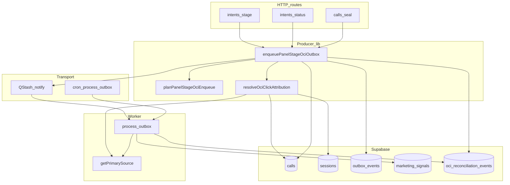

# OCI audit remediation — derinlemesine plan (deep)

Önceki yüzeysel planın üzerine: veri düzlemi, kontrol düzlemi, taşıma, işçi, dış sistem, operasyon ve tehdit modeli. Amaç: **sessiz sönme**, **çift kafa**, **RPC–DB drift** ve **yanıltıcı API** için kapanış.

---

## Derinlik haritası (katmanlar)

| Katman | Ne | Risk örnekleri |
|--------|-----|----------------|
| L0 Veri | `calls`, `sessions`, `outbox_events`, `marketing_signals`, `oci_reconciliation_events` | RPC dönüşü DB ile drift; merge alanı yok |
| L0.5 Kısıt | Unique indexler, CHECK, dedupe hash | `oci_reconciliation_events_dedupe_uidx` aynı olayı yutar; “yazıldı” sanılır |
| L1 Üretici | Panel/seal → `enqueuePanelStageOciOutbox` | Insert false ama HTTP “queued” |
| L1.5 Bildirim | `notifyOutboxPending` / QStash | Publish swallow; cron gecikmesi |
| L2 İşçi | `claim_outbox_events`, `process-outbox` | FAILED + metrik; gear skip |
| L3 Dışa aktarım | Google script, ACK / ack-failed | Upload başarılı ACK kaybı |
| L4 Gözlem | Metrik, log, Sentry, export-coverage | Eski reason isimleri dashboard’da |
| L5 Operasyon | Feature flag, canary, runbook | Intent precursor env unutulur |
| L6b Uyumluluk | GDPR / audit / finansal rapor | Reconciliation payload’da PII sızıntısı |
| L7 Maliyet | Satır hacmi, index, egress | Outbox storm, reconciliation flood |
| L8 Kaos | Dayanıklılık oyunu | Cron+notify aynı anda ölür |
| L9 Formal | Taahhüt edilebilir özellikler | İnvaryant ihlali sessiz |
| L13 İnsan | Operatör, eğitim, hata ayıklama | Yanlış kartta stage; “queued” güveni |
| L14 SLO | Ölçülebilir hedefler | P95 gecikme tanımsız |
| L15 Tx | Dağıtık tutarlılık | RPC commit / outbox ayrı; yarım yazım |
| L16 Güvenlik | Anahtar, replay, kota | Sızıntı; script abuse |
| L17 İz | Korelasyon | Log’da outbox satırı bulunamıyor |
| L18 Gölge | Karar parity deneyi | Producer≠worker farkı üretimde |

---

## Bağımlılık grafiği (derin görünüm)

**Kritik kenar:** `Attr` ve `Proc` aynı `Gps` mantığına bağlı — bu kenar kırılırsa çift kafa geri gelir.

---

## L0 — Veri modeli ve idempotency (derin)

**Reconciliation dedupe:** [`lib/oci/evidence-hash.ts`](lib/oci/evidence-hash.ts) `buildOciEvidenceHash` — `primaryClickIdPresent` boolean; aynı skip tekrarlandığında 23505 → “sessiz idempotent”. **Derin risk:** operatör aynı kartta tekrar tekrar stage toggle → reconciliation sayacı artmayabilir; bu **doğru** ama “kaç kez denendi” kaybolur. İstenirse `payload.attempt_no` veya ayrı audit tablosu (aşırı mühendislik değilse `payload` içinde `client_request_id`).

**Outbox:** [`outbox_events`](supabase/migrations/20261113000000_outbox_events_table_claim_finalize.sql) — `site_id`, `call_id` index; **çoklu PENDING** aynı call için teorik (ürün kararı: insert öncesi “aynı call + aynı payload.stage PENDING” var mı” kontrolü opsiyonel derinleştirme).

**marketing_signals:** Unique `(site_id, call_id, google_conversion_name, adjustment_sequence)` — worker duplicate 23505 collapse; producer’ın çoklu outbox’u yine **işçi tarafında** sıkıştırılabilir ama outbox kuyruğu şişer.

**merged_into_call_id:** Child satırda panel aksiyonu **RLS / ürün kuralları** ile engellenmeli; yine de DB’den okunan savunma (Faz 1 önceki planda) **son çare doğruluk**.

---

## L0.5 — RLS ve aktör (derin)

Tüm mutasyonlar `service_role` / server route üzerinden; panel kullanıcısı doğrudan `outbox_events` yazmıyor. **Derin kontrol:** yeni “merge context” `select` çağrısı **aynı `site_id` scope** ile yapılmalı (mevcut `validateSiteAccess` sonrası route’ta `callId` zaten site’a bağlı — yine de `.eq('site_id', siteId)` zorunlu).

---

## L1 — Üretici atomikliği ve read-your-writes (derin)

**Sıra:** RPC commit → (isteğe bağlı) `calls` tekrar okuma → `enqueuePanelStageOciOutbox` → `notifyOutboxPending`.

**Derin yarış:** RPC sonrası başka worker aynı `call`’ı güncelledi; merge read eski snapshot alabilir. Mitigasyon: `select` sırasında `id` + `version` veya `updated_at` RPC dönüşü ile karşılaştırma; mismatch → log + yine de enqueue (veya 409) — **ürün kararı**.

**getPrimarySource çağrısı:** Producer’da bir kez, worker’da bir kez — arada `sessions`/`calls` click yazılırsa **worker daha zengin** primary görebilir; genelde güvenli. Tersi (producer’da vardı worker’da yok) replica lag — [`primary-source.ts`](lib/conversation/primary-source.ts) retry zaten var; **derin ölçüm:** `PRIMARY_SOURCE_RPC_NO_CLICK_IDS` Sentry path sayacı.

---

## L1.5 — notifyOutbox ve “sessiz” (derin)

[`notify-outbox.ts`](lib/oci/notify-outbox.ts): QStash hata **yutulur**; tasarım gereği cron güvenlik ağı. **Derin risk:** cron devre dışı / auth kırık → outbox PENDING birikir; panel “queued” hissi verir. **Plana ekle:** cron sağlık alarmı + `outbox_events` PENDING yaşlandırma metriği (Supabase scheduled veya mevcut cron metrikleri).

**Dedup bucket:** `NOTIFY_BUCKET_MS` — aynı call 10s içinde çok stage → tek trigger; **derin edge:** ilk mesaj işlenmeden ikinci outbox insert edilirse worker iki satır görebilir — process-outbox satır bazlı claim ile OK.

---

## L2 — Worker ve gear mantığı (derin)

[`process-outbox.ts`](lib/oci/outbox/process-outbox.ts): `getPrimarySource` ile tekrar doğrulama; `UNKNOWN_STUB` → FAILED + `OCI_CONTRACT_VIOLATION`. **Producer sonrası** click silindiğinde (nadir) worker FAILED üretir; producer reconcile yazmamış olabilir — **tutarlı**: reconciliation “neden enqueue ettik” değil “neden worker düştü”.

**Higher-gear skip:** Mevcut Won/contacted sıralaması; derin test: intent precursor contacted outbox sonra aynı gün Won — sıralama beklenen mi dokümante.

---

## L3 — API sözleşmesi ve istemci (derin)

**Sorun:** `queued: true` sabit ([`stage/route.ts`](app/api/intents/[id]/stage/route.ts)).

**Derin strateji:**

1. **Faz A (kırılmaz):** `oci_outbox_inserted: boolean`, `oci_reconciliation_reason?: string | null` (veya sadece `null` = insert path).
2. **Faz B (sürüm):** `x-ops-api-version` yeni minor — `queued := oci_outbox_inserted` dokümante kırılım.
3. **status route** şu an `queued` yok; seal yok — **hizalama:** üç yüzde aynı şema (isteğe bağlı).

**Derin istemci:** Panel ön ucu `queued`’a güveniyorsa Aşama A’da geriye dönük: `queued` bırakılıp yeni alan SSOT (önceki plandaki B stratejisi).

---

## L3.5 — Reconciliation persist güvenilirliği (derin)

`appendReconciliationBestEffort` başarısız → şu an route `ok` sanabilir.

**Derin hedef:** `appendOciReconciliationEvent` sonucu `inserted` / hata propagate; enqueue `ok: false` veya `reconciliation_persisted: false` + metrik `panel_stage_reconciliation_persist_failed_total` (yeni metrik adı `lib/refactor/metrics.ts` listesine).

**23505 duplicate:** “yazılamadı” değil “zaten vardı” — `ok` için **başarılı idempotent** sayılabilir (ürün kararı).

---

## L4 — Dokümantasyon ve SSOT drift (derin)

- [`docs/runbooks/OCI_SSOT_TROUBLESHOOTING.md`](docs/runbooks/OCI_SSOT_TROUBLESHOOTING.md): reason matrisi (producer vs worker), `SESSION_NOT_FOUND` artık producer’da üretilmiyor notu, `NO_EXPORTABLE_OCI_STAGE` / `MERGED_CALL`.
- **Derin:** “Panel başarılı RPC” ≠ “OCI satırı oluştu” karar ağacı diyagramı (runbook’a mermaid).

---

## L5 — Feature flag ve intent precursor (derin)

`OCI_INTENT_PANEL_PRECURSOR_CONTACTED_ENABLED` — runbook’ta **ne zaman açılmalı**, **Google funnel riski**, **A/B veya tek site canary** prosedürü. Sync/ingest 2B **bilinçli olarak dışarıda** (önceki ürün kararı).

---

## L6 — Tehdit modeli (derin, kısa)

| Tehdit | Mitigasyon |
|--------|------------|
| Çift outbox aynı stage | İsteğe bağlı insert öncesi SELECT; worker idempotency |
| Sahte merge bypass | DB read `merged_into` |
| Reconciliation flood | Dedupe hash; rate limit panel |
| Cron ölümü | PENDING yaş metrik + alarm |

---

## L6b — Uyumluluk, gizlilik, denetim (daha derin)

- **Reconciliation `payload`:** Bugün `call_status`, `merged_into_call_id`, insert hata metni gibi alanlar gidebilir. **Kural:** telefon, ham IP, tam URL gibi **PII/log** alanlarını payload’a koyma; hash veya kısaltılmış token.
- **GDPR erase / freeze:** [tests/unit/compliance-freeze.test.ts](tests/unit/compliance-freeze.test.ts) bağlamında `calls`/`sessions` silinmez; OCI satırları **ne zaman** temizlenir / anonimleştirilir — runbook’ta “export sonrası saklama süresi” ile hizala.
- **Denetçi sorusu:** “Bu `marketing_signals` satırını hangi panel aksiyonu üretti?” — `causal_dna` / `outbox_events.id` zinciri; producer `payload`’a `source_surface` eklenmesi (opsiyonel derin iz) düşünülebilir.

---

## L7 — Maliyet ve cardinality (daha derin)

- **outbox_events:** Her panel tıklaması bir satır; burst operatör → satır patlaması. **Metrik:** site başına `insert rate` / `PENDING count`.
- **oci_reconciliation_events:** Dedupe ile büyüme yavaşlar ama **farklı reason** kombinasyonları çarpan açar. **Retention:** 90g sonra arşiv/partition (ürün kararı, migration).
- **getPrimarySource:** RPC + ekstra select; yüksek trafikte **connection pool** ve Supabase statement timeout gözlemi.

---

## L8 — Kaos mühendisliği / oyun günü senaryoları (daha derin)

| Senaryo | Beklenen sistem davranışı | Doğrulama |
|---------|---------------------------|-----------|
| QStash tamamen down | Cron ile `max(PENDING_age)` SLO içinde iş | Staging’de notify mock kill |
| Cron auth yanlış | PENDING birikir; alarm tetiklenir | Sahte `CRON_SECRET` |
| Aynı call 5x / 1s stage | Dedup bucket + birden fazla outbox satırı; worker hepsini işler veya gear skip | Load test |
| DB read replica gecikmesi | Producer/worker farklı primary (nadir) | Retry metrikleri |
| `finalize_outbox_event` yarım | PROCESSING stuck | `processing_started_at` alarm (migration yorumları) |

---

## L9 — Formal özellikler (taahhüt listesi — daha derin)

Aşağıdakiler **hedef özellikler**; her biri için birim veya entegrasyon testi bağlanır:

1. **INV-ProducerClick:** Panel enqueue kararı, aynı `callId` için `getPrimarySource(siteId,{callId})` ile aynı “click var/yok” boole sonucuna indirgenebilir (test click hariç aynı küme).
2. **INV-NoSilentSuccess:** `enqueuePanelStageOciOutbox` dönüşünde `outboxInserted === false` iken `reconciliationPersisted === false` ise `ok` **false** olmalı (Faz 3 sonrası).
3. **INV-MergedNoOutbox:** `merged_into_call_id` dolu çağrıda `outbox_events` insert sayacı 0.
4. **INV-SiteScope:** Tüm OCI yazımları `site_id` filtresi ile; cross-tenant `call_id` çarpışması imkânsız.

---

## L10 — Google Ads tarafı (daha derin, uygulama dışı ama sistem sınırı)

- **Conversion action drift:** Müşteri hesabında aksiyon adı değişti → upload 400; **sistem cevabı:** `marketing_signals` FAILED / retry; runbook’ta “Ads UI kontrol listesi”.
- **Para birimi / değer:** `currency` payload ile site config uyumu; seal path farklıysa dokümante.
- **ACK çift gönderim:** Script aynı batch’i iki kez yüklerse Google idempotency; bizim tarafta `dispatch_status` geçişleri tutarlı mı — export worker incelemesi (ayrı dosya).

---

## L11 — Zaman ve tutarlılık (daha derin)

- **conversion_time vs `occurred_at`:** `upsertMarketingSignal` / outbox payload `confirmed_at` zinciri; yaz saati TZ kayması.
- **Geçmişe dönük conversion:** Google politikasına aykırı upload → worker FAILED; operatör geri alamaz mı — panel “geri al” OCI etkisi (invalidate zaten junk’ta var).

---

## L12 — Geri alma (rollback) planı (daha derin)

- **Anında:** `OCI_INTENT_PANEL_PRECURSOR_CONTACTED_ENABLED=false`; deploy revert.
- **Veri:** Yanlışlıkla çoğalan `outbox_events` PENDING — seçici `VOID` yoksa manuel SQL runbook (sadece onaylı ortam).
- **İletişim:** Müşteriye “24 saat içinde Google’da yinelenen dönüşüm” uyarısı şablonu.

---

## L13 — İnsan ve operasyonel model (en derin “yumuşak” katman)

- **Yanlış kart:** Aynı `call_id`’ye değil komşu karta tıklama; UI’de `oci_outbox_inserted` göstermek hata ayıklamayı hızlandırır.
- **Eğitim:** “RPC 200 = Google’a gitti” değil; üç kutucuk: **RPC**, **outbox**, **marketing_signals PENDING**.
- **Vardiya devir:** PENDING outbox yaşını günlük kontrol listesine ekle (NOC runbook).

---

## L14 — SLI / SLO önerileri (ölçülebilir derinlik)

| SLI | Tanım (örnek) | SLO fikri (tartışılır) |
|-----|----------------|-------------------------|
| `outbox_pending_age_p95` | PENDING satırların yaşı p95 | staging `<5m`, prod `<30m` |
| `reconciliation_persist_fail_rate` | append başarısız / toplam skip | `<0.1%` |
| `primary_source_null_rate` | worker’da null / toplam outbox iş | site bazlı alarm eşiği |
| `notify_publish_fail_rate` | QStash publish hata oranı | cron ile telafi; eşik ops |

**Not:** SLO’lar ürün ve altyapı onayı olmadan sayı bağlanmaz; plana “ölçüm tanımı” olarak yazıldı.

---

## L15 — Dağıtık işlem sınırları (transaction derinliği)

- **RPC + outbox tek DB transaction değil** (farklı round-trip); arada process ölürse: RPC persist, outbox yok → kart güncellenmiş ama OCI yok. **Mitigasyon:** (a) outbox insert retry aynı request içinde 1 kez, (b) idempotent client `request_id` ile tekrar stage POST (panel zaten version conflict ile kısmen koruyor).
- **Outbox insert + notify:** notify başarısız olsa outbox satırı **source of truth**; bu iyi. **Kötü:** insert rollback olursa notify yine tetiklenmiş olabilir mi? — sıra: insert sonra notify; insert fail → notify çağrılmamalı (kod incelemesi maddesi).

---

## L16 — Güvenlik ve kötüye kullanım (derin)

- **Export batch:** `x-api-key` / site scope; brute force ve site-id enumeration riski — rate limit + WAF notu.
- **Anahtar rotasyonu:** `oci_api_key` değişince eski script’lerin 401 davranışı; runbook “önce yeni key dağıt, sonra eskiyi düşür”.
- **Worker URL:** QStash imzalı çağrı; URL sızıntısı replay — imza süresi ve secret rotasyonu.

---

## L17 — Gözlemlenebilirlik korelasyonu (derin)

- **`x-request-id`** (panel route zaten üretiyor) → `outbox_events.payload.request_id` veya `metadata` içine yazılması önerisi: tek trace ile Vercel log ↔ Supabase satır birleşir.
- **OpenTelemetry span** (varsa): `enqueuePanelStageOciOutbox` child span `oci.producer.decision`.

---

## L18 — Gölge / parity deneyi (ileri seviye, isteğe bağlı)

- **Shadow mode:** Üretimde `planPanelStageOciEnqueue` sonucunu **outbox yazmadan önce** worker’ın `getPrimarySource` sonucu ile karşılaştır (async fire-and-forget); mismatch → metrik `oci_producer_worker_primary_mismatch_total`. Maliyet: çift okuma; sadece kısa canary.

---

## L19 — Gear sırası (sipariş teorisi — derin ama hafif)

- Stage set `{junk, contacted, offered, won}` üzerinde **single-conversion** politikası bir kısmi sıra verir; dokümante özellik: “`won` varsa düşük gear bastırılır” ([`process-outbox`](lib/oci/outbox/process-outbox.ts) mevcut). **Formal:** monoton `rank(stage)` ile `rank(existing) > rank(requested)` ⇒ skip — test tablosu üretilebilir.

---

## L20 — Altyapı ve felaket (derin)

- **Supabase PITR / branch:** Yanlış toplu backfill sonrası dönüş prosedürü (sadece runbook başlığı).
- **Bölgesel:** Primary DB read replica lag; producer kritik yol için **primary read** tercihi (Supabase client routing kararı).

---

## L21 — Rıza / hukuk sınırı (derin, ürün hukuk ile)

- **Consent:** `enqueueSealConversion` yolunda consent kontrolü vardı; **signal** yollarında marketing rızası ayrı mı — ürün/hukuk ile “click var = upload OK” mi yoksa `consent_scopes` şart mı netleştirilmeli; aksi halde OCI **teknik olarak mümkün** ama **hukuken riskli**.

---

## Uygulama fazları (önceki plan + derin genişletme)

**Faz 1 — Merge + DB read merge (değişmedi, derin notlar eklendi)**  
Helper + version/stale opsiyonu.

**Faz 2 — API gerçeği**  
`oci_outbox_inserted` + istemci stratejisi A→B.

**Faz 3 — Reconciliation persist**  
23505 vs gerçek hata ayrımı; yeni metrik.

**Faz 4 — Dokümantasyon + diyagram**  
Runbook derinleştirme.

**Faz 5 — Gözlem derinliği**  
PENDING outbox yaş histogramı; `notify` failure counter (varsa genişlet); `getPrimarySource` null oranı site bazlı.

**Faz 6 (isteğe bağlı) — Outbox ön dedupe**  
Aynı `call_id` + `payload.stage` + PENDING tekilleştirme (migration veya partial unique index — Postgres partial unique dikkat).

---

## Test derinliği

- Birim: merge helper, enqueue return shape, reconcile persist (mock admin insert fail vs 23505).
- Entegrasyon: RPC sonrası `merged_into` set edilen fixture (varsa) veya doğrudan DB seed.
- Kontrat: `x-ops-api-version` response şeması snapshot (isteğe bağlı).
- **INV testleri:** L9’daki dört özellik için ayrı test dosyası veya mevcut `enqueue-panel-stage-oci-click-alignment` genişletmesi.
- **Kaos (isteğe bağlı):** Staging’de cron kapalı + burst stage script’i (manuel runbook adımı).

---

## Genişletilmiş yapılacaklar (özet checklist)

- [ ] Faz 1: merge context + opsiyonel version check  
- [ ] Faz 2: API `oci_outbox_inserted` + `queued` stratejisi  
- [ ] Faz 3: reconciliation persist + 23505 ayrımı + metrik  
- [ ] Faz 4: runbook + mermaid + PII kuralları  
- [ ] Faz 5: PENDING yaş + notify/cron sağlık  
- [ ] Faz 6: outbox ön-dedupe ADR  
- [ ] L9: dört INV için test bağlantısı  
- [ ] L8: staging kaos senaryosu dokümantasyonu  
- [ ] L14: SLI tanımları + dashboard / Metabase notu  
- [ ] L15: insert→notify sırası kod denetimi + tek istek retry politikası  
- [ ] L16–L17: export rate limit + `request_id` payload (ADR)  
- [ ] L18: shadow parity (canary süreli)  
- [ ] L19: gear rank tablo testi  
- [ ] L20–L21: PITR runbook başlığı + consent matrisi (hukuk workshop)  

---

## Özet

Bu turda plana **insan/SLO (L13–L14), dağıtık tx ve notify sırası (L15), güvenlik ve korelasyon (L16–L17), gölge parity (L18), gear formalizasyonu (L19), felaket ve hukuk (L20–L21)** eklendi. Önceki **L0–L12 + fazlar** aynen geçerli; uygulama önceliği yine **Faz 1–4**, ardından gözlem ve güvenlik maddeleri ekip ve uyumluluk takvimine göre **paralel** yürütülebilir.
