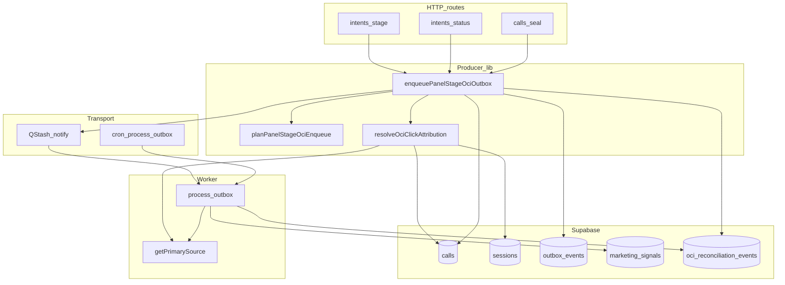

# OCI audit remediation — derinlemesine plan (deep)

Önceki yüzeysel planın üzerine: veri düzlemi, kontrol düzlemi, taşıma, işçi, dış sistem, operasyon ve tehdit modeli. Amaç: **sessiz sönme**, **çift kafa**, **RPC–DB drift** ve **yanıltıcı API** için kapanış.

---

## Derinlik haritası (katmanlar)

| Katman | Ne | Risk örnekleri |
|--------|-----|----------------|
| L0 Veri | `calls`, `sessions`, `outbox_events`, `marketing_signals`, `oci_reconciliation_events` | RPC dönüşü DB ile drift; merge alanı yok |
| L0.5 Kısıt | Unique indexler, CHECK, dedupe hash | `oci_reconciliation_events_dedupe_uidx` aynı olayı yutar; “yazıldı” sanılır |
| L1 Üretici | Panel/seal → `enqueuePanelStageOciOutbox` | Insert false ama HTTP “queued” |
| L1.5 Bildirim | `notifyOutboxPending` / QStash | Publish swallow; cron gecikmesi |
| L2 İşçi | `claim_outbox_events`, `process-outbox` | FAILED + metrik; gear skip |
| L3 Dışa aktarım | Google script, ACK / ack-failed | Upload başarılı ACK kaybı |
| L4 Gözlem | Metrik, log, Sentry, export-coverage | Eski reason isimleri dashboard’da |
| L5 Operasyon | Feature flag, canary, runbook | Intent precursor env unutulur |
| L6b Uyumluluk | GDPR / audit / finansal rapor | Reconciliation payload’da PII sızıntısı |
| L7 Maliyet | Satır hacmi, index, egress | Outbox storm, reconciliation flood |
| L8 Kaos | Dayanıklılık oyunu | Cron+notify aynı anda ölür |
| L9 Formal | Taahhüt edilebilir özellikler | İnvaryant ihlali sessiz |
| L13 İnsan | Operatör, eğitim, hata ayıklama | Yanlış kartta stage; “queued” güveni |
| L14 SLO | Ölçülebilir hedefler | P95 gecikme tanımsız |
| L15 Tx | Dağıtık tutarlılık | RPC commit / outbox ayrı; yarım yazım |
| L16 Güvenlik | Anahtar, replay, kota | Sızıntı; script abuse |
| L17 İz | Korelasyon | Log’da outbox satırı bulunamıyor |
| L18 Gölge | Karar parity deneyi | Producer≠worker farkı üretimde |

---

## Bağımlılık grafiği (derin görünüm)

**Kritik kenar:** `Attr` ve `Proc` aynı `Gps` mantığına bağlı — bu kenar kırılırsa çift kafa geri gelir.

---

## L0 — Veri modeli ve idempotency (derin)

**Reconciliation dedupe:** [`lib/oci/evidence-hash.ts`](lib/oci/evidence-hash.ts) `buildOciEvidenceHash` — `primaryClickIdPresent` boolean; aynı skip tekrarlandığında 23505 → “sessiz idempotent”. **Derin risk:** operatör aynı kartta tekrar tekrar stage toggle → reconciliation sayacı artmayabilir; bu **doğru** ama “kaç kez denendi” kaybolur. İstenirse `payload.attempt_no` veya ayrı audit tablosu (aşırı mühendislik değilse `payload` içinde `client_request_id`).

**Outbox:** [`outbox_events`](supabase/migrations/20261113000000_outbox_events_table_claim_finalize.sql) — `site_id`, `call_id` index; **çoklu PENDING** aynı call için teorik (ürün kararı: insert öncesi “aynı call + aynı payload.stage PENDING” var mı” kontrolü opsiyonel derinleştirme).

**marketing_signals:** Unique `(site_id, call_id, google_conversion_name, adjustment_sequence)` — worker duplicate 23505 collapse; producer’ın çoklu outbox’u yine **işçi tarafında** sıkıştırılabilir ama outbox kuyruğu şişer.

**merged_into_call_id:** Child satırda panel aksiyonu **RLS / ürün kuralları** ile engellenmeli; yine de DB’den okunan savunma (Faz 1 önceki planda) **son çare doğruluk**.

---

## L0.5 — RLS ve aktör (derin)

Tüm mutasyonlar `service_role` / server route üzerinden; panel kullanıcısı doğrudan `outbox_events` yazmıyor. **Derin kontrol:** yeni “merge context” `select` çağrısı **aynı `site_id` scope** ile yapılmalı (mevcut `validateSiteAccess` sonrası route’ta `callId` zaten site’a bağlı — yine de `.eq('site_id', siteId)` zorunlu).

---

## L1 — Üretici atomikliği ve read-your-writes (derin)

**Sıra:** RPC commit → (isteğe bağlı) `calls` tekrar okuma → `enqueuePanelStageOciOutbox` → `notifyOutboxPending`.

**Derin yarış:** RPC sonrası başka worker aynı `call`’ı güncelledi; merge read eski snapshot alabilir. Mitigasyon: `select` sırasında `id` + `version` veya `updated_at` RPC dönüşü ile karşılaştırma; mismatch → log + yine de enqueue (veya 409) — **ürün kararı**.

**getPrimarySource çağrısı:** Producer’da bir kez, worker’da bir kez — arada `sessions`/`calls` click yazılırsa **worker daha zengin** primary görebilir; genelde güvenli. Tersi (producer’da vardı worker’da yok) replica lag — [`primary-source.ts`](lib/conversation/primary-source.ts) retry zaten var; **derin ölçüm:** `PRIMARY_SOURCE_RPC_NO_CLICK_IDS` Sentry path sayacı.

---

## L1.5 — notifyOutbox ve “sessiz” (derin)

[`notify-outbox.ts`](lib/oci/notify-outbox.ts): QStash hata **yutulur**; tasarım gereği cron güvenlik ağı. **Derin risk:** cron devre dışı / auth kırık → outbox PENDING birikir; panel “queued” hissi verir. **Plana ekle:** cron sağlık alarmı + `outbox_events` PENDING yaşlandırma metriği (Supabase scheduled veya mevcut cron metrikleri).

**Dedup bucket:** `NOTIFY_BUCKET_MS` — aynı call 10s içinde çok stage → tek trigger; **derin edge:** ilk mesaj işlenmeden ikinci outbox insert edilirse worker iki satır görebilir — process-outbox satır bazlı claim ile OK.

---

## L2 — Worker ve gear mantığı (derin)

[`process-outbox.ts`](lib/oci/outbox/process-outbox.ts): `getPrimarySource` ile tekrar doğrulama; `UNKNOWN_STUB` → FAILED + `OCI_CONTRACT_VIOLATION`. **Producer sonrası** click silindiğinde (nadir) worker FAILED üretir; producer reconcile yazmamış olabilir — **tutarlı**: reconciliation “neden enqueue ettik” değil “neden worker düştü”.

**Higher-gear skip:** Mevcut Won/contacted sıralaması; derin test: intent precursor contacted outbox sonra aynı gün Won — sıralama beklenen mi dokümante.

---

## L3 — API sözleşmesi ve istemci (derin)

**Sorun:** `queued: true` sabit ([`stage/route.ts`](app/api/intents/[id]/stage/route.ts)).

**Derin strateji:**

1. **Faz A (kırılmaz):** `oci_outbox_inserted: boolean`, `oci_reconciliation_reason?: string | null` (veya sadece `null` = insert path).
2. **Faz B (sürüm):** `x-ops-api-version` yeni minor — `queued := oci_outbox_inserted` dokümante kırılım.
3. **status route** şu an `queued` yok; seal yok — **hizalama:** üç yüzde aynı şema (isteğe bağlı).

**Derin istemci:** Panel ön ucu `queued`’a güveniyorsa Aşama A’da geriye dönük: `queued` bırakılıp yeni alan SSOT (önceki plandaki B stratejisi).

---

## L3.5 — Reconciliation persist güvenilirliği (derin)

`appendReconciliationBestEffort` başarısız → şu an route `ok` sanabilir.

**Derin hedef:** `appendOciReconciliationEvent` sonucu `inserted` / hata propagate; enqueue `ok: false` veya `reconciliation_persisted: false` + metrik `panel_stage_reconciliation_persist_failed_total` (yeni metrik adı `lib/refactor/metrics.ts` listesine).

**23505 duplicate:** “yazılamadı” değil “zaten vardı” — `ok` için **başarılı idempotent** sayılabilir (ürün kararı).

---

## L4 — Dokümantasyon ve SSOT drift (derin)

- [`docs/runbooks/OCI_SSOT_TROUBLESHOOTING.md`](docs/runbooks/OCI_SSOT_TROUBLESHOOTING.md): reason matrisi (producer vs worker), `SESSION_NOT_FOUND` artık producer’da üretilmiyor notu, `NO_EXPORTABLE_OCI_STAGE` / `MERGED_CALL`.
- **Derin:** “Panel başarılı RPC” ≠ “OCI satırı oluştu” karar ağacı diyagramı (runbook’a mermaid).

---

## L5 — Feature flag ve intent precursor (derin)

`OCI_INTENT_PANEL_PRECURSOR_CONTACTED_ENABLED` — runbook’ta **ne zaman açılmalı**, **Google funnel riski**, **A/B veya tek site canary** prosedürü. Sync/ingest 2B **bilinçli olarak dışarıda** (önceki ürün kararı).

---

## L6 — Tehdit modeli (derin, kısa)

| Tehdit | Mitigasyon |
|--------|------------|
| Çift outbox aynı stage | İsteğe bağlı insert öncesi SELECT; worker idempotency |
| Sahte merge bypass | DB read `merged_into` |
| Reconciliation flood | Dedupe hash; rate limit panel |
| Cron ölümü | PENDING yaş metrik + alarm |

---

## L6b — Uyumluluk, gizlilik, denetim (daha derin)

- **Reconciliation `payload`:** Bugün `call_status`, `merged_into_call_id`, insert hata metni gibi alanlar gidebilir. **Kural:** telefon, ham IP, tam URL gibi **PII/log** alanlarını payload’a koyma; hash veya kısaltılmış token.
- **GDPR erase / freeze:** [tests/unit/compliance-freeze.test.ts](tests/unit/compliance-freeze.test.ts) bağlamında `calls`/`sessions` silinmez; OCI satırları **ne zaman** temizlenir / anonimleştirilir — runbook’ta “export sonrası saklama süresi” ile hizala.
- **Denetçi sorusu:** “Bu `marketing_signals` satırını hangi panel aksiyonu üretti?” — `causal_dna` / `outbox_events.id` zinciri; producer `payload`’a `source_surface` eklenmesi (opsiyonel derin iz) düşünülebilir.

---

## L7 — Maliyet ve cardinality (daha derin)

- **outbox_events:** Her panel tıklaması bir satır; burst operatör → satır patlaması. **Metrik:** site başına `insert rate` / `PENDING count`.
- **oci_reconciliation_events:** Dedupe ile büyüme yavaşlar ama **farklı reason** kombinasyonları çarpan açar. **Retention:** 90g sonra arşiv/partition (ürün kararı, migration).
- **getPrimarySource:** RPC + ekstra select; yüksek trafikte **connection pool** ve Supabase statement timeout gözlemi.

---

## L8 — Kaos mühendisliği / oyun günü senaryoları (daha derin)

| Senaryo | Beklenen sistem davranışı | Doğrulama |
|---------|---------------------------|-----------|
| QStash tamamen down | Cron ile `max(PENDING_age)` SLO içinde iş | Staging’de notify mock kill |
| Cron auth yanlış | PENDING birikir; alarm tetiklenir | Sahte `CRON_SECRET` |
| Aynı call 5x / 1s stage | Dedup bucket + birden fazla outbox satırı; worker hepsini işler veya gear skip | Load test |
| DB read replica gecikmesi | Producer/worker farklı primary (nadir) | Retry metrikleri |
| `finalize_outbox_event` yarım | PROCESSING stuck | `processing_started_at` alarm (migration yorumları) |

---

## L9 — Formal özellikler (taahhüt listesi — daha derin)

Aşağıdakiler **hedef özellikler**; her biri için birim veya entegrasyon testi bağlanır:

1. **INV-ProducerClick:** Panel enqueue kararı, aynı `callId` için `getPrimarySource(siteId,{callId})` ile aynı “click var/yok” boole sonucuna indirgenebilir (test click hariç aynı küme).
2. **INV-NoSilentSuccess:** `enqueuePanelStageOciOutbox` dönüşünde `outboxInserted === false` iken `reconciliationPersisted === false` ise `ok` **false** olmalı (Faz 3 sonrası).
3. **INV-MergedNoOutbox:** `merged_into_call_id` dolu çağrıda `outbox_events` insert sayacı 0.
4. **INV-SiteScope:** Tüm OCI yazımları `site_id` filtresi ile; cross-tenant `call_id` çarpışması imkânsız.

---

## L10 — Google Ads tarafı (daha derin, uygulama dışı ama sistem sınırı)

- **Conversion action drift:** Müşteri hesabında aksiyon adı değişti → upload 400; **sistem cevabı:** `marketing_signals` FAILED / retry; runbook’ta “Ads UI kontrol listesi”.
- **Para birimi / değer:** `currency` payload ile site config uyumu; seal path farklıysa dokümante.
- **ACK çift gönderim:** Script aynı batch’i iki kez yüklerse Google idempotency; bizim tarafta `dispatch_status` geçişleri tutarlı mı — export worker incelemesi (ayrı dosya).

---

## L11 — Zaman ve tutarlılık (daha derin)

- **conversion_time vs `occurred_at`:** `upsertMarketingSignal` / outbox payload `confirmed_at` zinciri; yaz saati TZ kayması.
- **Geçmişe dönük conversion:** Google politikasına aykırı upload → worker FAILED; operatör geri alamaz mı — panel “geri al” OCI etkisi (invalidate zaten junk’ta var).

---

## L12 — Geri alma (rollback) planı (daha derin)

- **Anında:** `OCI_INTENT_PANEL_PRECURSOR_CONTACTED_ENABLED=false`; deploy revert.
- **Veri:** Yanlışlıkla çoğalan `outbox_events` PENDING — seçici `VOID` yoksa manuel SQL runbook (sadece onaylı ortam).
- **İletişim:** Müşteriye “24 saat içinde Google’da yinelenen dönüşüm” uyarısı şablonu.

---

## L13 — İnsan ve operasyonel model (en derin “yumuşak” katman)

- **Yanlış kart:** Aynı `call_id`’ye değil komşu karta tıklama; UI’de `oci_outbox_inserted` göstermek hata ayıklamayı hızlandırır.
- **Eğitim:** “RPC 200 = Google’a gitti” değil; üç kutucuk: **RPC**, **outbox**, **marketing_signals PENDING**.
- **Vardiya devir:** PENDING outbox yaşını günlük kontrol listesine ekle (NOC runbook).

---

## L14 — SLI / SLO önerileri (ölçülebilir derinlik)

| SLI | Tanım (örnek) | SLO fikri (tartışılır) |
|-----|----------------|-------------------------|
| `outbox_pending_age_p95` | PENDING satırların yaşı p95 | staging `<5m`, prod `<30m` |
| `reconciliation_persist_fail_rate` | append başarısız / toplam skip | `<0.1%` |
| `primary_source_null_rate` | worker’da null / toplam outbox iş | site bazlı alarm eşiği |
| `notify_publish_fail_rate` | QStash publish hata oranı | cron ile telafi; eşik ops |

**Not:** SLO’lar ürün ve altyapı onayı olmadan sayı bağlanmaz; plana “ölçüm tanımı” olarak yazıldı.

---

## L15 — Dağıtık işlem sınırları (transaction derinliği)

- **RPC + outbox tek DB transaction değil** (farklı round-trip); arada process ölürse: RPC persist, outbox yok → kart güncellenmiş ama OCI yok. **Mitigasyon:** (a) outbox insert retry aynı request içinde 1 kez, (b) idempotent client `request_id` ile tekrar stage POST (panel zaten version conflict ile kısmen koruyor).
- **Outbox insert + notify:** notify başarısız olsa outbox satırı **source of truth**; bu iyi. **Kötü:** insert rollback olursa notify yine tetiklenmiş olabilir mi? — sıra: insert sonra notify; insert fail → notify çağrılmamalı (kod incelemesi maddesi).

---

## L16 — Güvenlik ve kötüye kullanım (derin)

- **Export batch:** `x-api-key` / site scope; brute force ve site-id enumeration riski — rate limit + WAF notu.
- **Anahtar rotasyonu:** `oci_api_key` değişince eski script’lerin 401 davranışı; runbook “önce yeni key dağıt, sonra eskiyi düşür”.
- **Worker URL:** QStash imzalı çağrı; URL sızıntısı replay — imza süresi ve secret rotasyonu.

---

## L17 — Gözlemlenebilirlik korelasyonu (derin)

- **`x-request-id`** (panel route zaten üretiyor) → `outbox_events.payload.request_id` veya `metadata` içine yazılması önerisi: tek trace ile Vercel log ↔ Supabase satır birleşir.
- **OpenTelemetry span** (varsa): `enqueuePanelStageOciOutbox` child span `oci.producer.decision`.

---

## L18 — Gölge / parity deneyi (ileri seviye, isteğe bağlı)

- **Shadow mode:** Üretimde `planPanelStageOciEnqueue` sonucunu **outbox yazmadan önce** worker’ın `getPrimarySource` sonucu ile karşılaştır (async fire-and-forget); mismatch → metrik `oci_producer_worker_primary_mismatch_total`. Maliyet: çift okuma; sadece kısa canary.

---

## L19 — Gear sırası (sipariş teorisi — derin ama hafif)

- Stage set `{junk, contacted, offered, won}` üzerinde **single-conversion** politikası bir kısmi sıra verir; dokümante özellik: “`won` varsa düşük gear bastırılır” ([`process-outbox`](lib/oci/outbox/process-outbox.ts) mevcut). **Formal:** monoton `rank(stage)` ile `rank(existing) > rank(requested)` ⇒ skip — test tablosu üretilebilir.

---

## L20 — Altyapı ve felaket (derin)

- **Supabase PITR / branch:** Yanlış toplu backfill sonrası dönüş prosedürü (sadece runbook başlığı).
- **Bölgesel:** Primary DB read replica lag; producer kritik yol için **primary read** tercihi (Supabase client routing kararı).

---

## L21 — Rıza / hukuk sınırı (derin, ürün hukuk ile)

- **Consent:** `enqueueSealConversion` yolunda consent kontrolü vardı; **signal** yollarında marketing rızası ayrı mı — ürün/hukuk ile “click var = upload OK” mi yoksa `consent_scopes` şart mı netleştirilmeli; aksi halde OCI **teknik olarak mümkün** ama **hukuken riskli**.

---

## L22 — T10 veri invariantları ve schema SSOT

**Hedef:** Migration seti, canlı DB ve operatörün baktığı schema artifactleri aynı gerçeği söylemeli.

- **Ledger coverage:** Canlı sayımda queue satırlarının anlamlı bir kısmı `oci_queue_transitions` kaydı olmadan göründü. Bunlar için `ledger_coverage_audit` yapılmalı: legacy/baseline mı, migration öncesi satır mı, yoksa gerçekten journal boşluğu mu ayrıştırılmalı. Gerekirse güvenli `SYSTEM_BACKFILL` baseline transition üretilmeli veya açıkça `legacy_unjournaled` sınıfına alınmalı.
- **`schema.sql` / `schema_utf8.sql` drift:** Root dump dosyaları PR-9J migration gerçekliğini taşımıyor; `BLOCKED_PRECEDING_SIGNALS`, grant posture, FK davranışı, snapshot priority ve yeni RPC/table objeleri drift durumda. Plan kuralı: security/schema review için **yalnız `supabase/migrations/` ordered chain** SSOT; dump dosyaları ya yeniden üretilecek ya da “non-authoritative” olarak işaretlenecek.
- **FSM split:** `enforce_offline_conversion_queue_state_machine` eski Phase 21 matrisiyle `BLOCKED_PRECEDING_SIGNALS -> QUEUED` yolunu anlatmıyor. Ya bu trigger migration ile güncellenecek ya da superseded/drop edilip tek FSM contract kalacak.
- **`marketing_signals` topology:** Migration zinciri `marketing_signals` drop ederken app ve sonraki `ALTER IF EXISTS`/parity yolları hâlâ bu tabloyu varsayabiliyor. Queue-only SSOT kararı tekrar netleştirilmeli: tablo yoksa parity trigger yok; varsa exposure/constraint yeniden tanımlanmalı.
- **Click-id DB invariant:** Upload policy `gclid > wbraid > gbraid` app/script seviyesinde; DB mutual-exclusion yok. DB row çoklu click-id taşıyabilir, upload katmanı exactly-one üretmeli ve test edilmeli.
- **Outbox lineage FK:** `source_outbox_event_id` FK `NOT VALID`; validate planı ve historical orphan audit eklenmeli.
- **Action/value/time/currency:** `action` conversion-name setine DB FK/CHECK ile bağlı değil; currency ISO/TRY policy kısmen app/doküman. T10 için en azından health SQL + release gate coverage olmalı.

---

## L23 — T10 upstream conversion source kilidi

**Hedef:** Panel/sales/router/outbox/journal hepsi aynı conversion identity modelini kullansın; sales veya junk yolları Google export gate dışında kalmasın.

- **Sales reconcile `call_id` boşluğu:** `enqueue-from-sales` / `reconcile_confirmed_sale_queue_v1` sale/session tabanlı queue row üretebiliyor; export build `call_id` null ise blokluyor. Sales lane ya call-bound yapılmalı ya export gate bu lane için ayrı ve güvenli provenance kabul etmeli.
- **Identity scheme drift:** Sale reconcile `purchase + sale_id + session` external_id kullanırken won journal `OpsMantik_Won + callId + session` kullanıyor. Aynı iş sonucu iki identity ile oluşabilir; dedup/action model tekleştirilmeli.
- **Junk retraction order_id:** Junk reversal `sessionId: null` ile hash üretebiliyor; original upload session-bound ise retraction Google’da doğru conversion’a bağlanmayabilir. Retraction original terminal queue row’dan `external_id`/session almalı.
- **Sendability transient failure:** `fetchCallSendabilityContext` DB hatasında `status=null` ile hard deterministic failure üretebiliyor. Transient DB/PostgREST hatası retryable sınıfa ayrılmalı.
- **Payload/live status race:** Outbox payload stage’i ile canlı `calls.status` farklılaşırsa valid-at-write event fail olabilir. Payload snapshot version/updated_at veya deliberate stale policy eklenmeli.
- **Won without sealed:** `status=won` tek başına seal export için yeterli kabul ediliyor. Ürün kararı buysa contract’a yazılmalı; değilse `oci_status=sealed` stricte alınmalı.
- **Blocked invalidation:** Junk reversal `BLOCKED_PRECEDING_SIGNALS` satırlarını invalidation kapsamına almıyor. Blocked rows da lifecycle cleanup’a dahil edilmeli.
- **Intent precursor flag:** `OCI_INTENT_PANEL_PRECURSOR_CONTACTED_ENABLED` kapalıysa intent-click leads outbox’a düşmez. Bu bir ürün flag’i olarak runbook ve SLO’da görünmeli.

---

## L24 — T10 Google Ads script ve deployment gerçekliği

**Hedef:** “Hangi script gerçekten Ads hesabında çalışıyor?” sorusunun cevabı DB heartbeat + hash + generated artifact ile kanıtlanmalı.

- **Tek engine:** Koç script PR-9I universal click-id policy ile çalışıyor; production template hâlâ `gclid only`, legacy Muratcan/Tecrübeli farklı davranıyor. Tüm siteler tek canonical universal engine’e taşınmalı veya site bazlı policy explicit DB’de saklanmalı.
- **Generated artifact kanıtı:** `scripts/google-ads-oci/dist` boşsa build sistemi pratikte deployment kanıtı üretmiyor. Release gate `build:google-ads-script -- --site=<slug>` çıktısını ve hash manifestini istemeli.
- **Script heartbeat:** `oci_script_versions` var ama Google Ads scriptleri gerçek heartbeat çağrısı yapmalı. Heartbeat payload: site, script_version, script_hash, feature flags, run_mode, click-id policy.
- **Out-of-band deployment:** Vercel deploy script kodunu Ads hesabına taşımaz. Runbook “paste/upload exact generated file + verify heartbeat hash” prosedürüyle kapanmalı.
- **Legacy script quarantine:** `GoogleAdsScript.js`, `GoogleAdsScriptProduction.js`, site forkları ve `deploy/*.js` için “deprecated / canonical / active” matrisi yapılmalı.
- **ACK payload parity:** Tüm scriptlerde `export_run_id`, selected click-id counters, multiple-click-id stats ve script summary aynı contract ile gitmeli.

---

## L25 — T10 ACK, adjustment ve export closure edge cases

**Hedef:** ACK başarılı görünürken projection/adjustment/Redis/receipt tarafında yarım kapanış kalmasın.

- **Projection/adjustment ACK math:** `proj_*` / `adj_*` missing veya wrong-status ID’ler `alreadyTerminal` gibi sayılmamalı. Missing, filtered, wrong-status ayrı warnings değil hard mismatch olmalı.
- **Projection/adjustment update errors:** `call_funnel_projection` ve `conversion_adjustments` update hataları log-only kalmamalı; ACK response ve receipt snapshot başarısızlığı taşımalı.
- **Adjustment anchoring:** `/api/oci/adjustments` original terminal queue row bulmadan `conversion_adjustments` insert edebiliyor. Restatement/retraction için original terminal success anchor zorunlu veya explicit manual override approval olmalı.
- **Duplicate retractions:** Outbox redelivery junk reversal’da aynı logical retraction’ı çoklayabilir. `conversion_adjustments` için `(site_id, order_id, adjustment_type, reason/source_event)` unique/idempotency key eklenmeli.
- **PV Redis cleanup:** ACK sonrası Redis cleanup partial failure sadece warning; DB SSOT olsa da PV stuck/retry etkisi SLO’da görünmeli.
- **Granular failed ACK:** Failed row sadece `PROCESSING` ise state değişiyor; row `RETRY/QUEUED` race durumunda hidden failure kalabilir. Script failure semantics state-machine ile yeniden netleştirilmeli.
- **Ghost cursor consensus:** Cursor repair sadece `COMPLETED` row’lara bakıyor; `UPLOADED` pending confirmation dönemini consensus’a dahil etmeli veya bilinçli dışarıda bırakmalı.
- **Dead fake-JWE helper:** Kullanılmayan sync helper gerçek encryption değil; ya kaldırılmalı ya fail-closed olmalı.
- **Rate limit fail-open:** Export route fail-open policy privacy/blast-radius açısından gate veya alert ile izlenmeli.

---

## L26 — T10 concurrency ve exactly-once sınırı

**Hedef:** At-least-once transport olsa bile provider upload tek mantıksal karar gibi davransın.

- **Fast-path vs cron claim overlap:** API-mode fast path `PROCESSING + claimed_at + claimed_by` gördüğünde owner’ın `FASTPATH_OCI_EXPORT` olduğunu doğrulamıyor; cron claim ettiği row’a fast path de upload yapabilir. Claim owner/token equality zorunlu olmalı.
- **Provider success / DB commit gap:** Provider accepted sonra DB transition yazılamadan process ölürse QStash retry duplicate upload deneyebilir. Provider idempotency + external_id/order_id kesin kanıtlanmalı; DB’de “provider_request_started” veya outbox receipt düşünülebilir.
- **QStash + cron çift sürüş:** Outbox worker ve cron safety-net aynı logical worker’ı çalıştırıyor. `claim_outbox_events` SKIP LOCKED iyi ama maxDuration cut + PROCESSING rescue SLO ile bağlanmalı.
- **Legacy lock fallback TTL:** Redis failure + legacy mode DB fallback 60s lease kullanıyor; route TTL 300/540/660s olabilir. Fallback RPC TTL parametreli olmalı veya legacy mode yasaklanmalı.
- **Unlocked thin crons:** `oci-recovery`, `ack-receipt-ttl`, `outbox-cleanup` gibi route’lar lock’suz. Idempotent olsalar bile schedule retry çakışması load/noise yaratır; standard lock wrapper uygulanmalı.
- **Internal worker bypass:** `CRON_SECRET + x-opsmantik-internal-worker` QStash signature bypass’ı ikinci transport auth yüzeyi; secret rotation ve scope runbook’a girmeli.

---

## L27 — T10 cron, runtime ve altyapı

**Hedef:** Cron gerçekten çalışmıyorsa ya fail etsin ya heartbeat/SLO alarmı yaksın; “HTTP 200 ama iş yok” yeşil sayılmasın.

- **`maxDuration`:** OCI cron route’larında `maxDuration` yok. Heavy routes için explicit duration, batch limit ve timeout budget contract yazılmalı.
- **Schedule overlap:** `oci-maintenance`, `oci-recovery`, `oci/sweep-zombies`, `process-outbox-events` rollerinin çakışması azaltılmalı. Consolidation yorumları ile `vercel.json` gerçekliği aynı olmalı.
- **Cron auth hybrid:** Prod/preview `NODE_ENV=production` ise hybrid mode hem `x-vercel-cron` hem Bearer ister. Vercel cron’un Bearer gönderdiği kanıtlanmalı veya `CRON_AUTH_MODE` stratejisi netleşmeli.
- **Lock observability:** Lock acquire result backend/reason her cron heartbeat/log payload’ına girmeli.
- **Upstash/QStash env:** Missing Redis/QStash creds, missing `NEXT_PUBLIC_APP_URL`/`VERCEL_URL`, import-time fail-fast ve silent notify skip release env gate’e bağlanmalı.
- **Admin env first-touch:** `NEXT_PUBLIC_SUPABASE_URL` / `SUPABASE_SERVICE_ROLE_KEY` yoksa route ilk Supabase çağrısında patlıyor; deploy preflight env check şart.
- **Schema cache:** PostgREST `PGRST202/PGRST203/PGRST204` deploy sonrası gerçek risk; migration sonrası schema refresh/retry/verify adımı planlanmalı.

---

## L28 — T10 observability ve SLO doğruluk

**Hedef:** Dashboard/health/heartbeat “boş backlog” veya “ok:true” ile gerçek hatayı saklamasın.

- **Watchtower HTTP semantics:** Alarm/critical durumunda sadece body `ok:false` değil, monitor-friendly status veya dedicated health endpoint olmalı. `WATCHTOWER_OK` log label degraded/alarm için yanıltıcı.
- **Billing metrics fidelity:** Watchtower in-memory billing metrics kullanıyor; Redis/global metrics ile hizalanmalı.
- **Drift unknown:** Billing drift query failure `ok` sayılmamalı; `UNKNOWN/DB_NOT_CHECKED` status olmalı.
- **Threshold alignment:** Watchtower 4h PROCESSING eşiği ile queue health 15m eşiği farklı; alert contract tekleştirilmeli.
- **Partition drift automation:** `/api/watchtower/partition-drift` manual POST ise release/cron rail’e dahil edilmeli veya retired.
- **`oci_site_health_v1` refresh:** MV var ama app refresh etmiyor. Cron/maintenance step veya direct view yerine live query seçilmeli.
- **Heartbeat coverage:** `vercel.json` scheduled crons ile `cron_job_heartbeats` coverage aynı değil; release SQL critical jobs listesi genişletilmeli.
- **Soft-zero metrics:** Admin metrics DB errors -> `0` count dönmemeli; “DB not checked” ile kırmızı/sarı olmalı.
- **Sentry/log parity:** Script heartbeat, Telegram alerting, Redis metric failures structured log/Sentry path’e bağlanmalı.
- **Sampling/cost:** `tracesSampleRate: 1.0` prod SLO maliyet/noise kararı olarak izlenmeli.

---

## L29 — T10 release, runbook ve sahte yeşil

**Hedef:** PASS yazan artifact gerçekten intended production state’i kanıtlasın.

- **MCP-only migration policy:** README ve eski runbook’lar `supabase db push` diyorsa MCP-only policy ile çelişiyor. İlk-line docs düzeltilmeli; escape hatch ayrı incident-only prosedür olmalı.
- **Critical migration inventory:** Release evidence `CRITICAL_MIGRATIONS` yeni PR-9J migrationlarını otomatik kapsamıyor. Gate ya migration head diff’i zorunlu kılmalı ya critical list güncellenmeli.
- **Deploy gate docs:** `smoke:intent-multi-site` optional/mandatory anlatımı dokümanlarda çelişiyor. Canonical deploy gate tek sayfada toplanmalı.
- **PR CI parity:** PR workflow static evidence, local `test:release-gates:pr` ve `test:release-gates` aynı kapsamda değil. `runtime-budget`, unit pins ve schedule tests coverage kararı netleşmeli.
- **Waived PASS readability:** `overall_status: PASS` + waiver/unverified alanları operatör tarafından yanlış okunabilir. Artifact headline `PASS_WITH_WAIVER` veya `production_go` daha görünür olmalı.
- **Vercel build gating:** `predeploy` Vercel tarafından doğal çalışmaz. Build command veya CI deploy gate ile zorunlu hale getirilmeli.
- **Target DB ambiguity:** `oci-rollout-readiness` ve `verify-db` hangi Supabase URL env’deyse ona bakıyor; prod URL claim ve redacted target zorunlu.
- **Health endpoint:** `/api/health` `ok:true` + `db_ok:false` dönebiliyor. Prod uptime monitor için DB-aware endpoint veya non-200 policy.
- **Sentry release:** Fixed version ile git SHA drift; release identifier deploy commit’e bağlanmalı.

---

## L30 — T10 security, tenant ve Data API posture

**Hedef:** Script key, service role route ve authenticated Data API sınırları açık ve testli olsun.

- **Stale signals leak:** `app/api/ops/stale-signals` tenant visibility açısından en açık cross-site yüzey olarak ayrıca kapatılmalı veya admin-only yapılmalı.
- **Ack receipt completion:** `complete_ack_receipt_v1` `receipt_id` ile site-independent update yapıyor. Service-role-only olsa da DB invariant için `site_id` de WHERE’e eklenmeli.
- **Export summary trust:** `persistExportRunSummary` route auth’a güveniyor; summary content/site match secondary validation eklenebilir.
- **GDPR rate-limit key:** Raw `site_id` ile public_id/uuid farklı buckets; canonical `siteUuid` kullanılmalı.
- **Schema grant drift:** Root dumps anon/auth grants gösteriyor ama migrations service_role-only. Security tests full revoked RPC/table surface’i doğrulamalı.
- **RLS exposed tables:** `offline_conversion_queue` ve `oci_reconciliation_events` tenant-visible SELECT yüzeyi; bu sensitivity boundary docs’a yazılmalı.
- **Verify-db fallback:** Service key yoksa anon fallback hardened RPC posture’u eksik test eder. Strict production verify service-role zorunlu olmalı.
- **Rate-limit/key rotation:** Site API key rotation, export abuse, fail-open rate limit ve worker bypass same secret blast-radius threat model’e girmeli.

---

## L31 — T10 operator script karantinası

**Hedef:** `scripts/db` ile service_role arka kapısı plan dışı queue mutasyonu yapamasın.

- **Critical mutators:** `reset-muratcan-queue.mjs`, `simulate-script-flow.mjs`, `oci-cleanup-junk-and-backfill-intent-contacted.ts` quarantine.
- **High mutators:** `oci-clone-completed-ms.ts`, `oci-requeue-all-failed.mjs`, `oci-repair-marketing-signal-queue-parity.ts`, `oci-pipeline-fill-and-report.mjs` approval + dry-run default + RPC-only standardına taşınmalı.
- **Direct queue updates:** GCLID/currency/value/fix scripts direct `.update` yerine canonical RPC veya explicit forensic transition ile çalışmalı.
- **Default safety:** Tüm mutating scripts default dry-run; live için `--apply` + typed approval token + target site + output plan + no-localhost check.
- **Credential leak:** Hardcoded API key/prod URL içeren scriptler temizlenmeli, secrets repo dışına taşınmalı.
- **NPM script labels:** `package.json` içindeki dangerous db scripts “unsafe” namespace veya guard wrapper ile ayrılmalı.

---

## L32 — T10 test/gate genişletmesi

**Hedef:** Yukarıdaki T10 invariants release gate’te görünmeden deploy yeşil olmasın.

- Ledger coverage live/read-only check.
- Script policy uniformity + generated artifact hash manifest check.
- Cron heartbeat coverage vs `vercel.json` diff check.
- `maxDuration` presence check for scheduled cron routes.
- `CRITICAL_MIGRATIONS` freshness / migration head includes latest expected files.
- DB grant posture test for full OCI RPC/table revoked surface.
- FSM integration test: `BLOCKED_PRECEDING_SIGNALS -> QUEUED`, terminal downgrade blocked, FAILED egress limited.
- ACK projection/adjustment mismatch tests.
- Fast-path claim-owner race test.
- Operator scripts safety static test: no direct queue mutation unless allowlisted guarded pattern.
- Health/evidence test: no `PASS` headline if waiver/unverified production blockers remain.
- Google Ads script unit tests for universal click-id selection and heartbeat payload.

---

## Uygulama fazları (önceki plan + derin genişletme)

**Faz 0 — T10 kanıt envanteri ve stop-the-line sınıflandırma**  
Canlı DB invariant sayımları, script deployment hash durumu, cron heartbeat coverage, release evidence waiver listesi, operator script risk inventory. Çıktı: “known red/yellow/green” matrisi.

**Faz 1 — DB invariant ve ledger kilidi**  
Ledger coverage audit/backfill, schema dump SSOT kararı, FSM split repair, FK validation plan, external_id/action/currency/value gaps için DB/test planı.

**Faz 2 — Upstream conversion source tekliği**  
Sales reconcile `call_id`/identity drift, junk retraction hash, sendability transient retry, blocked invalidation, payload/live race.

**Faz 3 — Script uniformity ve deployment heartbeat**  
Universal PR-9I engine, generated dist/hash manifest, real script heartbeat, legacy fork quarantine.

**Faz 4 — ACK/export/adjustment closure**  
Projection/adjustment hard mismatch, original terminal anchor, duplicate retraction idempotency, ghost cursor, Redis PV partial SLO, fake-JWE removal.

**Faz 5 — Concurrency ve runtime**  
Fast-path claim owner, provider success/DB gap, cron/QStash overlap, locks, `maxDuration`, cron auth/env preflight.

**Faz 6 — Observability ve release gates**  
Watchtower semantics, MV refresh, heartbeat coverage, production evidence no-waiver clarity, target DB strictness, schema cache check.

**Faz 7 — Operator script quarantine + docs repair**  
Dangerous scripts guard/wrap/remove, README/runbook deploy gate drift fix, MCP-only migration docs, Sentry/release identity.

**Önceki Faz 2 — API gerçeği (korunur)**  
`oci_outbox_inserted` + istemci stratejisi A→B.

**Önceki Faz 3 — Reconciliation persist (korunur)**  
23505 vs gerçek hata ayrımı; yeni metrik.

**Önceki Faz 4 — Dokümantasyon + diyagram (T10 docs içine taşınır)**  
Runbook derinleştirme.

**Önceki Faz 5 — Gözlem derinliği (T10 observability ile birleşir)**  
PENDING outbox yaş histogramı; `notify` failure counter (varsa genişlet); `getPrimarySource` null oranı site bazlı.

**Önceki Faz 6 (isteğe bağlı) — Outbox ön dedupe**  
Aynı `call_id` + `payload.stage` + PENDING tekilleştirme (migration veya partial unique index — Postgres partial unique dikkat).

---

## Test derinliği

- Birim: merge helper, enqueue return shape, reconcile persist (mock admin insert fail vs 23505).
- Entegrasyon: RPC sonrası `merged_into` set edilen fixture (varsa) veya doğrudan DB seed.
- Kontrat: `x-ops-api-version` response şeması snapshot (isteğe bağlı).
- **INV testleri:** L9’daki dört özellik için ayrı test dosyası veya mevcut `enqueue-panel-stage-oci-click-alignment` genişletmesi.
- **Kaos (isteğe bağlı):** Staging’de cron kapalı + burst stage script’i (manuel runbook adımı).

---

## Genişletilmiş yapılacaklar (özet checklist)

- [ ] T10-0: canlı invariant snapshot + red/yellow/green evidence matrisi  
- [ ] T10-1: ledger coverage audit/backfill veya legacy classification  
- [ ] T10-2: schema dump SSOT kararı + migration freshness gate  
- [ ] T10-3: queue FSM split repair (`BLOCKED_PRECEDING_SIGNALS` dahil)  
- [ ] T10-4: sales reconcile `call_id`/identity drift remediation  
- [ ] T10-5: junk retraction original external_id/session anchoring  
- [ ] T10-6: sendability DB errors retryable vs deterministic ayrımı  
- [ ] T10-7: universal Google Ads script engine + generated hash manifest  
- [ ] T10-8: real script heartbeat + `oci_script_versions` release gate  
- [ ] T10-9: ACK projection/adjustment mismatch hard-fail  
- [ ] T10-10: adjustment original terminal anchor + duplicate retraction idempotency  
- [ ] T10-11: fast-path claim owner check + provider success/DB gap mitigation  
- [ ] T10-12: cron `maxDuration`, lock, heartbeat, auth, env preflight standardı  
- [ ] T10-13: `oci_site_health_v1` refresh/retire kararı  
- [ ] T10-14: watchtower/health endpoint non-misleading semantics  
- [ ] T10-15: release evidence waiver/production_go headline repair  
- [ ] T10-16: operator script quarantine + dry-run/approval/RPC-only pattern  
- [ ] T10-17: DB grant/RLS/security tests full OCI surface  
- [ ] T10-18: docs drift repair: README, onboarding, deploy gates, Google Ads script path  
- [ ] Faz 1: merge context + opsiyonel version check  
- [ ] Faz 2: API `oci_outbox_inserted` + `queued` stratejisi  
- [ ] Faz 3: reconciliation persist + 23505 ayrımı + metrik  
- [ ] Faz 4: runbook + mermaid + PII kuralları  
- [ ] Faz 5: PENDING yaş + notify/cron sağlık  
- [ ] Faz 6: outbox ön-dedupe ADR  
- [ ] L9: dört INV için test bağlantısı  
- [ ] L8: staging kaos senaryosu dokümantasyonu  
- [ ] L14: SLI tanımları + dashboard / Metabase notu  
- [ ] L15: insert→notify sırası kod denetimi + tek istek retry politikası  
- [ ] L16–L17: export rate limit + `request_id` payload (ADR)  
- [ ] L18: shadow parity (canary süreli)  
- [ ] L19: gear rank tablo testi  
- [ ] L20–L21: PITR runbook başlığı + consent matrisi (hukuk workshop)  

---

## Özet

Bu turda plana **T10 genişletmesi (L22–L32)** eklendi: DB invariant/schema SSOT, upstream conversion source kilidi, Google Ads script deployment gerçekliği, ACK/export closure edge case’leri, concurrency/exactly-once sınırları, cron/runtime altyapısı, observability/SLO doğruluğu, release sahte-yeşil riskleri, tenant/security posture, operator script quarantine ve gate genişletmeleri. Öncelik artık sadece “conversion gönderildi mi?” değil; **gönderim, dedupe, retry, script, cron, evidence ve operatör yüzeyi birlikte kanıtlanmadan T10 sayılmaması**dır.
