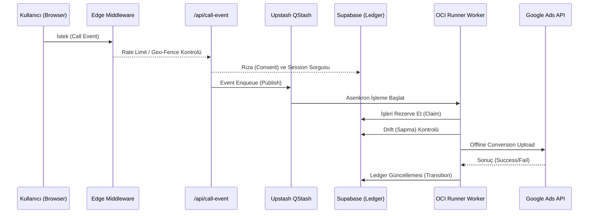

# OpsMantik Mimari Dokümantasyonu (Architecture Glossary)

Bu doküman, OpsMantik V1 altyapısında yer alan çekirdek kavramları ve akışları açıklamaktadır.

## 1. OCI (Offline Conversion Import) Veri Akışı

Sistem, Supabase veritabanındaki `calls` tablosunu dinleyerek, verileri QStash aracılığıyla asenkron olarak işler ve sonrasında işlenen verileri (Örn. Google Ads) offline dönüşüm olarak hedefe aktarır.



## 2. Watchtower (Gözlem Kulesi) Mimarisi

Sistem "Dead Man's Switch" (Ölü Adam Anahtarı) mantığıyla çalışır. Eğer hedeflenen periyotlarda belirli olaylar yaşanmazsa (örn. "son 1 saatte hiç session gelmediyse") sistem çökmüş kabul edilir ve alarm üretilir.

```mermaid
flowchart TD
    cron((Cron Job)) --> wt[Watchtower Service]
    wt --> check1[Session Vitality (Son 1 Saat)]
    wt --> check2[Attribution Liveness (Son 3 Saat GCLID)]
    wt --> check3[Ingest Publish Failures (Son 15 Dk)]
    wt --> check4[Billing Reconciliation Drift (Son 1 Saat)]
    
    check1 --> eval{Tüm Kontroller OK mi?}
    check2 --> eval
    check3 --> eval
    check4 --> eval
    
    eval -- Evet --> log[Sentry / Console Log]
    eval -- Hayır (Alarm) --> tg[Telegram Bildirimi (Critical/Degraded)]
```

## 3. Drift Tolerance (Sapma Toleransı) Nedir?

OCI Runner verileri Google Ads'e göndermeden hemen önce, kuyruktaki değer ile veritabanındaki taze satır değerini kontrol eder (`syncQueueValuesFromCalls`).
Önceleri sıkı eşleşme (strict equality `!==`) aranan bu algoritmada, finansal yuvarlamalar ve döviz kurlarından oluşabilecek çok küçük sapmalar nedeniyle tüm kuyruk tıkanabiliyordu (Fail-Closed). 

Yeni mimari ile `DRIFT_TOLERANCE_CENTS` (Örn: 100 kuruş) değeri kadar bir sapmaya müsamaha gösterilerek, veri akışının bozulmadan devam etmesi güvence altına alınmıştır. Sapma limitini aşan değişiklikler yine fail-closed prensibiyle kuyruğu FAILED statüsüne çeker.

