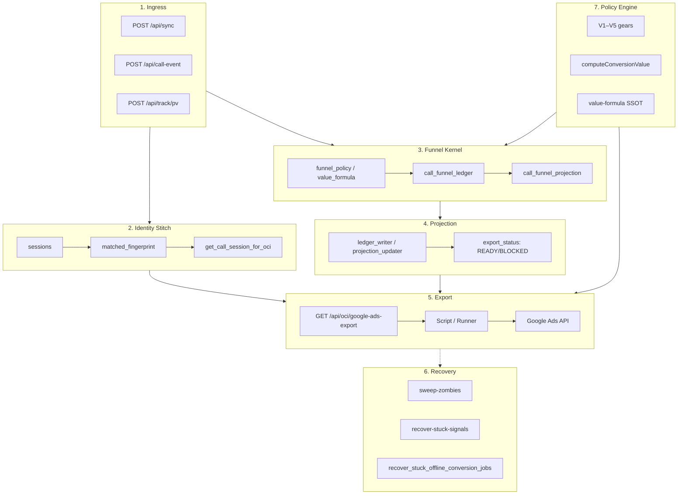

# OpsMantik Master Architecture Map

**Single-page architecture map** — entire system in one diagram.

---

## Master Flow

---

## Component Summary

| # | Component | Description |
|---|------------|-------------|
| 1 | **Ingress** | sync (events), call-event (intent), track/pv (pageview) |
| 2 | **Identity Stitch** | session → fingerprint, call → matched_session, GCLID resolution |
| 3 | **Funnel Kernel** | ledger (append-only), projection (funnel metrics / readiness), policy/weights |
| 4 | **Projection** | export_status READY/BLOCKED (kernel); **not** the `google-ads-export` batch table source |
| 5 | **Export** | `google-ads-export` → journal rows; Script or Runner uploads to Google Ads |
| 6 | **Recovery** | sweep-zombies (10 min), recover-stuck-signals (4 hr), queue recover |
| 7 | **Policy Engine** | V1–V5, value formula, floor/decay |

---

## Legacy vs Target

| Path | Components | Status |
|-----|------------|-------|
| **Target** | Ingress → ledger → projection → Export | SHADOW MODE |
| **Legacy planes** | `marketing_signals` + Redis V1 (not in script GET); **`offline_conversion_queue` → Google script export** | ACTIVE |

---

**Reference:** [Platform Overview](../overview/PLATFORM_OVERVIEW.md) | [OCI Operations Snapshot](../operations/OCI_OPERATIONS_SNAPSHOT.md)
