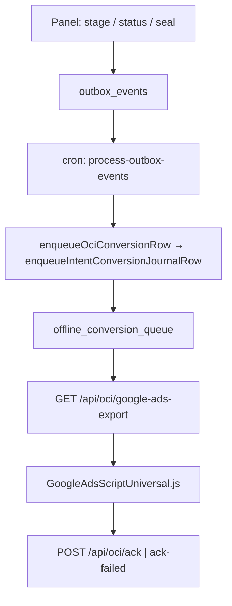

# Stage Authority Matrix — SEAL-00 validated

**Status:** VALIDATED (code evidence 2026-05-19)  
**Hypothesis confirmed:** All four operator stages journal to `offline_conversion_queue` only. Retired audit table dropped (`20261320120000` drop migration).

## Validation commands (re-run before CUT)

```bash
rg "enqueuePanelStageOciOutbox|enqueueIntentConversionJournalRow" lib app/api
rg "from\(['\"]offline_conversion_queue['\"]\)" app/api/oci
npm run test:oci-kernel
```

**Results (SEAL-00):**

- `app/api/**`, `lib/**`: queue-only OCI writers.
- Export: [`export-mark-processing.ts`](../../../app/api/oci/google-ads-export/export-mark-processing.ts) — journal only.
- Tests: `tests/chaos/export-dual-path-gate.test.ts`, `tests/unit/oci-retired-vocabulary-ban.test.ts`.

## Authority contract (code)

[`lib/oci/intent-conversion-journal-contract.ts`](../../../lib/oci/intent-conversion-journal-contract.ts) — queue SSOT only.

## End-to-end flow



## Per-stage matrix

| Stage | Conversion name | Writer (app) | Table / source | Export selector | Export endpoint | Script payload | ACK | ACK failed | Retry | Terminal status | Billing | Tests | Gaps |
|-------|-----------------|----------------|----------------|-----------------|-----------------|------------------|-----|------------|-------|-----------------|---------|-------|------|
| Contacted | OpsMantik_Contacted | `POST /api/intents/[id]/stage` → `enqueuePanelStageOciOutbox` | `outbox_events` → queue | `optimization_stage=contacted` | `/api/oci/google-ads-export` | `conversionName` + one click id or hp | `/api/oci/ack` | `/api/oci/ack-failed` | queue RETRY / DEAD_LETTER | UPLOADED, COMPLETED, COMPLETED_UNVERIFIED | idempotency / usage | `test:oci-kernel`, stage contract | 1-site E2E panel→ACK |
| Offered | OpsMantik_Offered | Same | Same | `offered` | Same | Same | Same | Same | Same | Same | Same | Same | Same |
| Won | OpsMantik_Won | `stage` **or** `POST /api/calls/[id]/seal` → outbox; seal path also `enqueueIntentConversionJournalRow` via [`enqueue-seal-conversion.ts`](../../../lib/oci/enqueue-seal-conversion.ts) | Same queue | `won` | Same | Same + sale value | Same | Same | Same | Same | sale amount on seal | seal + journal tests | Won E2E |
| Junk | OpsMantik_Junk_Exclusion | `stage` (`junk_exclusion`) | Same queue | `junk` | Same | Same | Same | Same | Same | COMPLETED / exclusion paths | exclusion | junk boundary | — |

## Conversion names SSOT

[`lib/oci/conversion-names.ts`](../../../lib/oci/conversion-names.ts) — four canonical names only.
