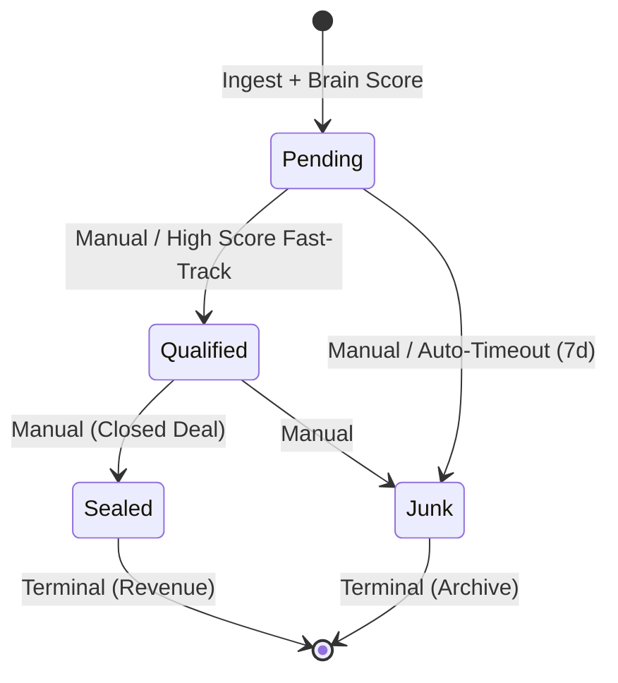

# ARCHITECTURAL STRATEGY: Lead Lifecycle, Timing, and Google Ads Temporal Rules

**Status**: PROPOSED  
**Principal Architect**: Antigravity  
**Context**: OCI Pipeline + Predictive Value Engine + Brain Score Engine  

---

## 1. Google Ads Postback Strategy (The 90-Day Window)

### The "Instant Signal" Policy (Pending Leads)
**Decision**: **YES, upload immediately.**  
We must push 'Pending' events to Google Ads within **Minute 0** of ingestion. 
- **Goal**: Feed the "Maximize Conversions" algorithm with volume and frequency.
- **Implementation**: Map `pending` to a "Soft Lead" conversion action in Google Ads.
- **Value**: Use `default_aov * weights.pending` (e.g., $2.00).

### Lifecycle Progression: New Actions vs. Adjustments
**Decision**: **Use Multi-Stage Conversion Actions.**  
While Google supports "Adjustments," the enterprise best practice for lead lifecycles is to use distinct conversion actions for different funnel stages.
- **Stage 1 (Soft Lead)**: Fired on `pending`.
- **Stage 2 (Qualified Lead)**: Fired on `qualified`.
- **Stage 3 (Sales/Sealed)**: Fired on `sealed`.
- **Why?**: This allows the operator to tell Google exactly which part of the funnel to optimize for. Adjustments are "too quiet" for smart bidding to react dynamically to stage transitions.

---

## 2. Lead State Machine & Auto-Timeouts

### The State Hierarchy

### Auto-Garbage Collection (The Hygiene Rule)
- **TTL for Pending**: 7 Days.
- **Job**: A nightly cron `auto_junk_stale_leads` will transition any lead in `pending` for >168 hours to `junk`.
- **Rationale**: Keeps the CRM UI uncluttered and stops Google Ads from waiting for signals that will never come.

---

## 3. Brain Score Temporal Trigger (The Fast-Track)

We will implement a **Score-Based Lane Partitioning** logic in the ingest worker:

| Brain Score | Lane | Action |
| :--- | :--- | :--- |
| **High (>= 80)** | **Fast-Track** | Immediately push to Google Ads as `Qualified Lead`. Bypass manual queue. |
| **Mid (30-79)** | **Manual First** | Push to Google as `Pending Lead`. Wait for human review to upgrade to `Qualified`. |
| **Low (< 30)** | **Hold** | **Do NOT** push to Google immediately. Wait 24h. If no manual action, auto-push as `Pending` but flag as `Low Quality`. |

---

## 4. Deduplication & UI Debouncing (The "Frantic Operator" Guard)

### The OCI Submission Lock
We must prevent multiple API calls for the same stage transition.
- **Mechanism**: The `offline_conversion_queue` will have a unique constraint on `(call_id, conversion_action, action)`.
- **API Guard**: The OCI Runner will check `processed_at` for a specific call+action pair. If `synced`, ignore subsequent clicks.

### UI Debouncing
- **Client-Side**: 2-second visual debounce on status buttons.
- **Server-Side**: Optimistic locking in the `update_call_status` RPC. If the record is already being processed by a worker, the UI action is rejected with a 409 Conflict.

---

## 5. Metadata Schema Updates (Next Steps)
To support this, the `calls` table needs:
1. `last_status_change_at` (TIMESTAMPTZ).
2. `is_fast_tracked` (BOOLEAN).
3. `expires_at` (TIMESTAMPTZ, default now() + INTERVAL '7 days').

---

**Approval Required**: Please review the **Fast-Track Score Threshold (80)** and the **7-Day TTL**. Once approved, we will begin the Schema Migration and Queue Controller UI implementation.
