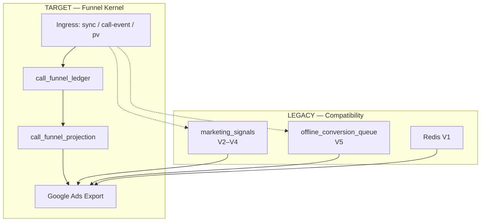

# OCI Operations Snapshot

**Last updated:** 2026-03-09  
**Owner:** OpsMantik Core  
**Sürüm:** Operations Snapshot v1 — ✅ Production Ready  
**Amaç:** OCI (Offline Conversion Import) ve dönüşüm sinyallerinin mevcut durumunun tek bakışta özeti. Onboarding, incident response, debug, mimari geçiş için.

**Kategori:** Production Operations Documentation

---

## Mimari Özet



---

> **Charter bağlantıları:** Bu belge tek başına geleceği değil, bugünü anlatır. Hedef mimari ve kontratlar için:
> - `docs/architecture/FUNNEL_CONTRACT.md` — Funnel Kernel Charter
> - `docs/architecture/EXPORT_CONTRACT.md` — Export Contract

**Etiket açıklaması:** `CURRENT` = bugün canlı, `TARGET` = hedef SSOT, `TRANSITIONAL` = geçiş döneminde, `RETIRED_SOON` = emekliye ayrılacak.

---

## 0. Transition Status

| Component | Status |
|-----------|--------|
| Funnel Kernel Ledger | ACTIVE |
| Projection Builder | ACTIVE |
| Projection Export | SHADOW MODE |
| Legacy Export | ACTIVE |
| Full Kernel SSOT | IN PROGRESS |

---

## 1. Özet — Beş Dönüşüm Seti (V1–V5) `CURRENT`

| Set | Google Ads adı | Depo | Oluşma yeri | Export'ta | Ack sonrası |
|-----|----------------|------|--------------|-----------|-------------|
| **V1** | OpsMantik_V1_Nabiz | **Redis** (pv:queue, pv:data) | POST /api/track/pv → V1PageViewGear | Redis LMOVE | pv_* → Redis DEL |
| **V2** | OpsMantik_V2_Ilk_Temas | **marketing_signals** | process-call-event, process-sync-event | PENDING seçilir | signal_* → SENT |
| **V3** | OpsMantik_V3_Nitelikli_Gorusme | **marketing_signals** | Seal lead_score=60 | PENDING | signal_* → SENT |
| **V4** | OpsMantik_V4_Sicak_Teklif | **marketing_signals** | Seal lead_score=80 | PENDING | signal_* → SENT |
| **V5** | OpsMantik_V5_DEMIR_MUHUR | **offline_conversion_queue** | Seal lead_score=100 + sale_amount | QUEUED/RETRY | seal_* → UPLOADED |

Üç depo: Redis (V1), marketing_signals (V2–V4), offline_conversion_queue (V5). Export üçünü birleştirip Script'e tek JSON döner; ack prefix'e göre ilgili depoyu günceller.

**Mimari Not**

> Bu rapor mevcut canlı durumun özetidir. **Funnel Kernel hedef SSOT'tur.** `marketing_signals` ve `offline_conversion_queue` şu an hâlâ canlı **compatibility katmanlarıdır.** Nihai export truth hedefi `call_funnel_projection`'dır.

---

## 2. Canlı Metrikler (GET /api/metrics) `CURRENT` + `TARGET`

Cron veya admin auth ile `GET /api/metrics` şu funnel_kernel metriklerini döner:

| Metrik | Etiket | Açıklama |
|--------|--------|----------|
| `ledger_count` | TARGET | call_funnel_ledger satır sayısı (yeni funnel SSOT) |
| `projection_count` | TARGET | call_funnel_projection toplam satır |
| `projection_ready_count` | TARGET | export_status=READY olanlar |
| `legacy_ms_count` | TRANSITIONAL | marketing_signals toplam satır |
| `legacy_queue_queued_retry` | TRANSITIONAL | offline_conversion_queue QUEUED + RETRY sayısı |
| `open_violations` | TARGET | funnel_invariant_violations (resolved_at null) |
| `blocked_incomplete_funnel_count` | TARGET | projection export_status=BLOCKED (eksik funnel) |

**Doğrulama:** Response `metrics.funnel_kernel` içinde tüm alanlar bulunur. Tablolar yoksa `{ status: 'tables_unavailable' }` döner.

---

## 3. Export Akışı — İki Mod

### 3.1 USE_FUNNEL_PROJECTION=true `TARGET`

- Export kaynağı: **call_funnel_projection** tek tablo
- Funnel Kernel dual-write ile ledger + projection besleniyor
- projection.export_status: READY | BLOCKED
- BLOCKED: funnel tamamlanmamış (V2/V3/V4 eksik vb.)

### 3.2 Legacy `TRANSITIONAL` (USE_FUNNEL_PROJECTION=false veya varsayılan)

- **offline_conversion_queue** (V5) + **marketing_signals** (V2–V4) + **Redis** (V1)
- Kuyruk: status IN (QUEUED, RETRY)
- Sinyaller: dispatch_status = PENDING
- Claim sonrası: queue → PROCESSING, signals → PROCESSING
- Ack sonrası: queue → UPLOADED, signals → SENT

---

## 4. Sinyal Durum Makineleri `CURRENT`

### marketing_signals.dispatch_status

**Aktif:** `PENDING`, `PROCESSING`  
**Terminal:** `SENT`, `FAILED`, `JUNK_ABORTED`, `DEAD_LETTER_QUARANTINE`

| Durum | Anlam | Sonraki |
|-------|-------|---------|
| PENDING | Export bekliyor | Export seçer → PROCESSING |
| PROCESSING | Script'e gönderildi, ack bekleniyor | Ack → SENT; ack-failed → FAILED |
| SENT | Google'a gitti | Terminal |
| FAILED | Hata (validation/upload) | Terminal |
| JUNK_ABORTED | Junk call, export sırasında atlandı | Terminal |
| DEAD_LETTER_QUARANTINE | Fatal hata sonrası | Terminal |

### offline_conversion_queue.status

**Aktif:** `QUEUED`, `RETRY`, `PROCESSING`  
**Terminal:** `UPLOADED`, `COMPLETED`, `FAILED`

| Durum | Anlam | Sonraki |
|-------|-------|---------|
| QUEUED | Kuyrukta | Claim → PROCESSING |
| RETRY | Hata sonrası tekrar denenecek | Claim → PROCESSING |
| PROCESSING | Export/upload yapıldı | Ack → UPLOADED; ack-failed → RETRY/FAILED |
| UPLOADED | Google'a gitti (Script path) | Terminal |
| COMPLETED | Worker path başarılı | Terminal |
| FAILED | Kalıcı hata | Terminal |

---

## 5. Bilinen Riskler ve Düzeltmeler `CURRENT`

**Severity:** `FIXED` = geçmişte kritikti, düzeltildi | `HIGH` = hâlâ aksiyon gerektirir | `MITIGATED` = azaltıldı, mekanizma eklendi | `CONTROLLED` = mekanizma var, izleniyor

| Konu | Severity | Durum | Not |
|------|----------|--------|-----|
| Ack signal_* PENDING → SENT | FIXED | ✅ Düzeltildi | Ack artık PROCESSING arıyor (önceden PENDING aranıyordu; nabız SENT olmuyordu) |
| 0 TL mühür Google'a gitmesin | FIXED | ✅ | Seal path: computeConversionValue null döner; enqueue yapılmaz. enqueue-from-sales: value_cents<=0 skip |
| PENDING sinyal takılması | MITIGATED | ✅ | Stuck-Signal-Recoverer eklendi: `recover_stuck_marketing_signals` RPC + `/api/cron/oci/recover-stuck-signals` (her 15 dk, 4 saatten eski PROCESSING → PENDING). sweep-zombies (10 dk) kısa vadeli; bu uzun vadeli güvenlik ağı. |
| Duplicate row (aynı gear) | CONTROLLED | ✅ | DB unique idx_marketing_signals_site_call_gear; 23505 idempotent |
| Duplicate queue row (aynı call) | CONTROLLED | ✅ | unique call_id; 23505 idempotent |
| Google duplicate conversion | CONTROLLED | ✅ | order_id deterministik; Google dedup yapar |

### Stuck-Signal-Recoverer ✅ Uygulandı

**Uygulama:** `recover_stuck_marketing_signals(p_min_age_minutes int DEFAULT 240)` RPC; cron: `/api/cron/oci/recover-stuck-signals` (her 15 dk).

- Tetikleyici: Vercel Cron `*/15 * * * *`
- Kriter: `dispatch_status = 'PROCESSING' AND lower(sys_period) < NOW() - INTERVAL '4 hours'`
- Aksiyon: `dispatch_status → 'PENDING'` (export tekrar seçebilir)
- Migration: `20261112000000_recover_stuck_marketing_signals.sql`

---

## 6. İntent vs Kuyruk Ayrımı `CURRENT`

| Konsept | Açıklama |
|---------|----------|
| **Intent** | Call henüz mühürlenmedi (status=intent, confirmed vb.) |
| **Kuyruk** | Sadece V5; satır sadece seal sonrası eklenir |
| Intent → V2 | marketing_signals'a gider (nabız). Kuyrukta satır yok; doğru davranış |
| İki giriş yolu | Sync (process-sync-event) ve Call-Event (process-call-event) → her ikisi de V2 yazar |

---

## 7. Hızlı Kontrol Komutları `CURRENT`

```bash
# Metrikler (CRON_SECRET gerekli)
curl -H "Authorization: Bearer $CRON_SECRET" "https://<APP>/api/metrics"

# Kuyruk istatistikleri
# GET /api/oci/queue-stats?siteId=...
```

Veritabanı sorguları (site bazlı):

```sql
-- marketing_signals dispatch durumu
SELECT dispatch_status, COUNT(*) FROM marketing_signals WHERE site_id = '...' GROUP BY dispatch_status;

-- offline_conversion_queue durumu
SELECT status, COUNT(*) FROM offline_conversion_queue WHERE site_id = '...' GROUP BY status;
```

---

## 8. Determinism Contract

**Single source of truth:** Funnel Kernel (ledger + projection). No dual-headed export paths.

| Kural | Uygulama |
|-------|----------|
| No null fallbacks in critical paths | conversionTime, value_cents, currency: missing → skip row and log (EXPORT_SKIP_*). No silent `now()` or `0`. |
| No best-effort in critical path | Seal V3/V4 emit and enqueue: fail loud (503) on error; no silent swallow. |
| Version required for seal | `body.version` required; 400 if omitted. Optimistic locking enforced. |
| Value SSOT | funnel-kernel computeSealedValue / computeExportValue. oci-config delegates. |
| Env secrets | OCI_SESSION_SECRET, VOID_LEDGER_SALT: no empty fallback in production; log when insecure fallback used. |
| Kill switch | OCI_EXPORT_PAUSED, OCI_SEAL_PAUSED: set to `true` or `1` to pause export/seal; returns 503. |

**Related:** `docs/architecture/DETERMINISM_CONTRACT.md`

---

## 9. Referans Dokümanlar

**Charter / kontrat (hedef mimari):**
- `docs/architecture/FUNNEL_CONTRACT.md` — Funnel Kernel Charter
- `docs/architecture/EXPORT_CONTRACT.md` — Export Contract
- `docs/architecture/DETERMINISM_CONTRACT.md` — Determinism rules (null policy, fail-closed, SSOT)
- `docs/architecture/MASTER_ARCHITECTURE_MAP.md` — Tek sayfa mimari harita

**Operasyon / audit:**
- `docs/runbooks/OCI_SISTEM_DERIN_ANALIZ.md` — 5 set, iki başlılık, akış
- `docs/runbooks/OCI_DONUSUM_INTENT_AKIS_SEMASI.md` — UI → dönüşüm eşlemesi
- `docs/runbooks/OCI_FIVE_GEAR_ARCHITECTURAL_AUDIT.md` — Mimari audit
- `docs/runbooks/OCI_CHAOS_RED_TEAM_AUDIT.md` — Chaos/retry analizi

---

## 10. Doküman Kalitesi Değerlendirmesi

| Kriter | Değerlendirme |
|--------|---------------|
| Teknik doğruluk | Çok iyi |
| Operasyonel değer | Yüksek |
| Okunabilirlik | İyi |
| Mimari olgunluk | Yüksek |

**Sonuç:** ✅ **OpsMantik OCI Operations Snapshot — Production Ready**

Bu belge onboarding, incident response, debug ve mimari geçiş için kullanılabilir.
