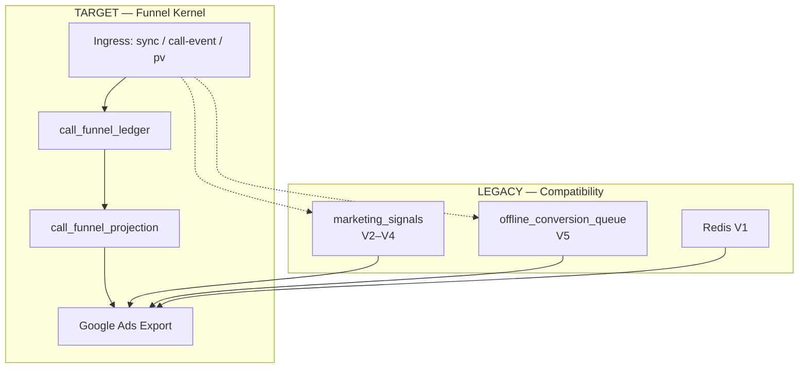

# OCI Operations Snapshot

**Last updated:** 2026-03-09  
**Owner:** OpsMantik Core  
**Version:** Operations Snapshot v1 — ✅ Production Ready  
**Purpose:** Single-glance summary of current OCI (Offline Conversion Import) and conversion signal state. For onboarding, incident response, debug, and architecture transition.

**Category:** Production Operations Documentation

---

## Architecture Summary



---

> **Charter links:** This document describes the current state, not the future. For target architecture and contracts:
> - `docs/architecture/FUNNEL_CONTRACT.md` — Funnel Kernel Charter
> - `docs/architecture/EXPORT_CONTRACT.md` — Export Contract

**Label:** `CURRENT` = live today, `TARGET` = target SSOT, `TRANSITIONAL` = in transition, `RETIRED_SOON` = to be retired.

---

## 0. Transition Status

| Component | Status |
|-----------|--------|
| Funnel Kernel Ledger | ACTIVE |
| Projection Builder | ACTIVE |
| Projection Export | SHADOW MODE |
| Legacy Export | ACTIVE |
| Full Kernel SSOT | IN PROGRESS |

---

## 1. Summary — Five Conversion Sets (V1–V5) `CURRENT`

| Set | Google Ads name | Store | Origin | In export | After ack |
|-----|----------------|------|--------|-----------|-----------|
| **V1** | OpsMantik_V1_Nabiz | **Redis** (pv:queue, pv:data) | POST /api/track/pv → V1PageViewGear | Redis LMOVE | pv_* → Redis DEL |
| **V2** | OpsMantik_V2_Ilk_Temas | **marketing_signals** | process-call-event, process-sync-event | PENDING selected | signal_* → SENT |
| **V3** | OpsMantik_V3_Nitelikli_Gorusme | **marketing_signals** | Seal lead_score=60 | PENDING | signal_* → SENT |
| **V4** | OpsMantik_V4_Sicak_Teklif | **marketing_signals** | Seal lead_score=80 | PENDING | signal_* → SENT |
| **V5** | OpsMantik_V5_DEMIR_MUHUR | **offline_conversion_queue** | Seal lead_score=100 + sale_amount | QUEUED/RETRY | seal_* → UPLOADED |

Three stores: Redis (V1), marketing_signals (V2–V4), offline_conversion_queue (V5). Export merges them into a single JSON for Script; ack updates the relevant store by prefix.

**Architecture note**

> This report is a summary of current live state. **Funnel Kernel is the target SSOT.** `marketing_signals` and `offline_conversion_queue` are currently live **compatibility layers.** The final export truth target is `call_funnel_projection`.

---

## 2. Live Metrics (GET /api/metrics) `CURRENT` + `TARGET`

With cron or admin auth, `GET /api/metrics` returns these funnel_kernel metrics:

| Metric | Label | Description |
|--------|--------|-------------|
| `ledger_count` | TARGET | call_funnel_ledger row count (new funnel SSOT) |
| `projection_count` | TARGET | call_funnel_projection total rows |
| `projection_ready_count` | TARGET | rows with export_status=READY |
| `legacy_ms_count` | TRANSITIONAL | marketing_signals total rows |
| `legacy_queue_queued_retry` | TRANSITIONAL | offline_conversion_queue QUEUED + RETRY count |
| `open_violations` | TARGET | funnel_invariant_violations (resolved_at null) |
| `blocked_incomplete_funnel_count` | TARGET | projection export_status=BLOCKED (incomplete funnel) |

**Verification:** All fields are present in response `metrics.funnel_kernel`. If tables are unavailable, returns `{ status: 'tables_unavailable' }`.

---

## 3. Export Flow — Two Modes

### 3.1 USE_FUNNEL_PROJECTION=true `TARGET`

- Export source: **call_funnel_projection** single table
- Funnel Kernel feeds ledger + projection via dual-write
- projection.export_status: READY | BLOCKED
- BLOCKED: funnel incomplete (V2/V3/V4 missing etc.)

### 3.2 Legacy `TRANSITIONAL` (USE_FUNNEL_PROJECTION=false or default)

- **offline_conversion_queue** (V5) + **marketing_signals** (V2–V4) + **Redis** (V1)
- Queue: status IN (QUEUED, RETRY)
- Signals: dispatch_status = PENDING
- After claim: queue → PROCESSING, signals → PROCESSING
- After ack: queue → UPLOADED, signals → SENT

---

## 4. Signal State Machines `CURRENT`

### marketing_signals.dispatch_status

**Active:** `PENDING`, `PROCESSING`  
**Terminal:** `SENT`, `FAILED`, `JUNK_ABORTED`, `DEAD_LETTER_QUARANTINE`

| Status | Meaning | Next |
|--------|---------|------|
| PENDING | Awaiting export | Export selects → PROCESSING |
| PROCESSING | Sent to Script, awaiting ack | Ack → SENT; ack-failed → FAILED |
| SENT | Sent to Google | Terminal |
| FAILED | Error (validation/upload) | Terminal |
| JUNK_ABORTED | Junk call, skipped during export | Terminal |
| DEAD_LETTER_QUARANTINE | After fatal error | Terminal |

### offline_conversion_queue.status

**Active:** `QUEUED`, `RETRY`, `PROCESSING`  
**Terminal:** `UPLOADED`, `COMPLETED`, `FAILED`

| Status | Meaning | Next |
|--------|---------|------|
| QUEUED | In queue | Claim → PROCESSING |
| RETRY | To be retried after error | Claim → PROCESSING |
| PROCESSING | Export/upload done | Ack → UPLOADED; ack-failed → RETRY/FAILED |
| UPLOADED | Sent to Google (Script path) | Terminal |
| COMPLETED | Worker path success | Terminal |
| FAILED | Permanent error | Terminal |

---

## 5. Known Risks and Fixes `CURRENT`

**Severity:** `FIXED` = was critical, now fixed | `HIGH` = still requires action | `MITIGATED` = reduced, mechanism in place | `CONTROLLED` = mechanism exists, monitored

| Topic | Severity | Status | Note |
|-------|----------|--------|------|
| Ack signal_* PENDING → SENT | FIXED | ✅ Fixed | Ack now looks for PROCESSING (previously PENDING; pulse was not becoming SENT) |
| 0 TL seal must not go to Google | FIXED | ✅ | Seal path: computeConversionValue returns null; no enqueue. enqueue-from-sales: value_cents<=0 skip |
| PENDING signal stuck | MITIGATED | ✅ | Stuck-Signal-Recoverer added: `recover_stuck_marketing_signals` RPC + `/api/cron/oci/recover-stuck-signals` (every 15 min, PROCESSING older than 4 hr → PENDING). sweep-zombies (10 min) short-term; this is long-term safety net. |
| Duplicate row (same gear) | CONTROLLED | ✅ | DB unique idx_marketing_signals_site_call_gear; 23505 idempotent |
| Duplicate queue row (same call) | CONTROLLED | ✅ | unique call_id; 23505 idempotent |
| Google duplicate conversion | CONTROLLED | ✅ | order_id deterministic; Google dedups |

### Stuck-Signal-Recoverer ✅ Implemented

**Implementation:** `recover_stuck_marketing_signals(p_min_age_minutes int DEFAULT 240)` RPC; cron: `/api/cron/oci/recover-stuck-signals` (every 15 min).

- Trigger: Vercel Cron `*/15 * * * *`
- Criterion: `dispatch_status = 'PROCESSING' AND lower(sys_period) < NOW() - INTERVAL '4 hours'`
- Action: `dispatch_status → 'PENDING'` (export can select again)
- Migration: `20261112000000_recover_stuck_marketing_signals.sql`

---

## 6. Intent vs Queue Distinction `CURRENT`

| Concept | Description |
|---------|-------------|
| **Intent** | Call not yet sealed (status=intent, confirmed, etc.) |
| **Queue** | V5 only; row added only after seal |
| Intent → V2 | Goes to marketing_signals (pulse). No queue row; correct behavior |
| Two entry paths | Sync (process-sync-event) and Call-Event (process-call-event) → both write V2 |

---

## 7. Quick Check Commands `CURRENT`

```bash
# Metrics (CRON_SECRET required)
curl -H "Authorization: Bearer $CRON_SECRET" "https://<APP>/api/metrics"

# Queue statistics
# GET /api/oci/queue-stats?siteId=...
```

Database queries (site-scoped):

```sql
-- marketing_signals dispatch status
SELECT dispatch_status, COUNT(*) FROM marketing_signals WHERE site_id = '...' GROUP BY dispatch_status;

-- offline_conversion_queue status
SELECT status, COUNT(*) FROM offline_conversion_queue WHERE site_id = '...' GROUP BY status;
```

---

## 8. Determinism Contract

**Single source of truth:** Funnel Kernel (ledger + projection). No dual-headed export paths.

| Rule | Implementation |
|------|----------------|
| No null fallbacks in critical paths | conversionTime, value_cents, currency: missing → skip row and log (EXPORT_SKIP_*). No silent `now()` or `0`. |
| No best-effort in critical path | Seal V3/V4 emit and enqueue: fail loud (503) on error; no silent swallow. |
| Version required for seal | `body.version` required; 400 if omitted. Optimistic locking enforced. |
| Value SSOT | funnel-kernel computeSealedValue / computeExportValue. oci-config delegates. |
| Env secrets | OCI_SESSION_SECRET, VOID_LEDGER_SALT: no empty fallback in production; log when insecure fallback used. |
| Kill switch | OCI_EXPORT_PAUSED, OCI_SEAL_PAUSED: set to `true` or `1` to pause export/seal; returns 503. |

**Related:** `docs/architecture/DETERMINISM_CONTRACT.md`

---

## 8b. Sunset Execution Plan (Phase 34)

| Item | Target |
|------|--------|
| call-event v1 | Sunset 2026-05-10; X-Ops-Deprecated header. Pre-sunset: client migration; v1 → 410 after sunset. |
| OCI Script Quarantine | Remove site from Script Properties per SOP. See `docs/runbooks/OCI_GOOGLE_ADS_SCRIPT_CONTROL.md` — Sunset Maneuver. |
| Dual-channel cutover | No dual-channel; Script Quarantine before worker cutover. |
| Legacy RPCs | v2 mandatory date; v1 fallback deprecated. |

---

## 9. Reference Documents

**Charter / contract (target architecture):**
- `docs/architecture/FUNNEL_CONTRACT.md` — Funnel Kernel Charter
- `docs/architecture/EXPORT_CONTRACT.md` — Export Contract
- `docs/architecture/DETERMINISM_CONTRACT.md` — Determinism rules (null policy, fail-closed, SSOT)
- `docs/architecture/MASTER_ARCHITECTURE_MAP.md` — Single-page architecture map

**Operations / audit:**
- `docs/architecture/OCI_QUEUE_HEALTH.md` — canonical queue statuses, claim semantics
- `docs/architecture/EXPORT_CONTRACT.md` — export shape + orderId collision mitigation
- `docs/architecture/OCI_VALUE_ENGINES_SSOT.md` — stage-base × quality-factor math SSOT
- `docs/runbooks/OCI_CONVERSION_INTENT_FLOW_DIAGRAM.md` — UI → conversion mapping
- `docs/runbooks/OCI_GOOGLE_ADS_SCRIPT_CONTROL.md` — script quarantine SOP

---

## 10. Document Quality Assessment

| Criterion | Assessment |
|-----------|------------|
| Technical accuracy | Very good |
| Operational value | High |
| Readability | Good |
| Architecture maturity | High |

**Result:** ✅ **OpsMantik OCI Operations Snapshot — Production Ready**

This document is suitable for onboarding, incident response, debug, and architecture transition.
