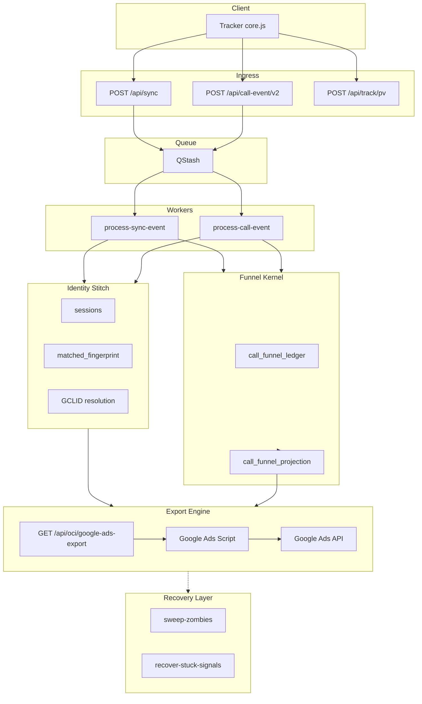

# OpsMantik Platform Overview

**System Architecture & Operations Summary** — Executive + technical overview. For new developer onboarding, investor/partner narrative, architecture quick view, and operations team reference.

**Last updated:** 2026-03-09

---

## What It Does

**OpsMantik** = **Offline Conversion Intelligence Platform**

Google Ads **Offline Conversion Import (OCI)** and lead intelligence platform. Matches traffic from websites with phone/WhatsApp calls; uploads conversions to Google Ads; enables ROI and attribution tracking.

**Value chain:**
- traffic → call
- call → attribution
- attribution → Google Ads OCI

| Function | Value |
|----------|-------|
| Multi-Touch Attribution | Chain from click to call via GCLID/wbraid/gbraid |
| Fingerprinting | Session–call matching via browser fingerprint |
| Lead Scoring | 0–100 score; Brain Score async worker |
| Five Conversion Sets (V1–V5) | V1 pulse → V2 first contact → V3 qualified → V4 hot intent → V5 seal |
| OCI Export | Conversion upload to Google Ads API |

---

## Architecture Flow



**Pipeline summary:** Tracker → Sync / Call Event → Identity Stitcher → Funnel Kernel → Projection → Export Engine → Google Ads → Recovery Layer

---

## Store Layers

| Layer | Purpose |
|-------|---------|
| Redis | V1 pageview pulse |
| marketing_signals | V2–V4 intent signals |
| offline_conversion_queue | V5 seal |
| call_funnel_ledger | append-only event log |
| call_funnel_projection | export SSOT (target architecture) |

---

## Transition Status

| Component | Status |
|-----------|--------|
| Funnel Kernel Ledger | ✅ ACTIVE |
| Projection Builder | ✅ ACTIVE |
| Projection Export | SHADOW MODE (default path) |
| Legacy Export | ✅ ACTIVE |
| Full Kernel SSOT | IN PROGRESS |

**Export:** Default `call_funnel_projection`. Legacy path fallback with `USE_FUNNEL_PROJECTION=false`.

**Message:** System stable; architecture upgrade in progress.

---

## Technology Stack

| Layer | Technology |
|-------|------------|
| API | Next.js (App Router) |
| DB | Supabase (PostgreSQL), monthly partition |
| KV | Upstash Redis (rate limit, replay cache, V1 queue) |
| Queue | QStash (async workers) |
| Hosting | Vercel |
| Auth | Google OAuth, RBAC (admin/operator/analyst/billing) |

Modern edge-serverless architecture.

---

## Cron Groups (Operational View)

| Group | Cron | Purpose |
|-------|------|---------|
| **Funnel** | funnel-repair (1 min), funnel-projection (5 min) | Funnel completion, projection update |
| **Recovery** | sweep-zombies (10 min), recover-stuck-signals (15 min) | Recover stuck PROCESSING rows |
| **Export** | enqueue-from-sales (1 hr) | Sales → OCI queue |
| **Outbox** | process-outbox-events (2 min) | Sync/call-event worker payload processing |
| **Observability** | watchtower (15 min) | System health check |
| **Compliance** | gdpr-retention (daily 05:00) | PII retention cleanup |

Self-healing layer: sweep-zombies, recover-stuck, funnel-repair.

---

## Determinism Contract (Production-Grade)

| Rule | Implementation |
|------|----------------|
| Fail-closed | Redis down → sync/call-event 503 |
| Kill switch | OCI_EXPORT_PAUSED, OCI_SEAL_PAUSED → 503 |
| Seal version | `version` required; 400 if omitted |
| No silent swallow | Tracker, sweep-zombies log failures |
| Error sanitization | `sanitizeErrorForClient` at API boundary |

The biggest risk in conversion systems is a nondeterministic pipeline; these rules reduce it.

---

## Deploy Gate

```bash
npm run smoke:intent-multi-site
```

**Purpose:** Multi-tenant safety check. Before deploy, intent pipeline is verified for at least two different sites (sync → events → calls). No deploy without 2/2 PASS.

**Sites (örnek):** yapiozmendanismanlik.com, sosreklam.com

---

## References

| Document | Purpose |
|----------|---------|
| [MASTER_ARCHITECTURE_MAP.md](../architecture/MASTER_ARCHITECTURE_MAP.md) | Single-page architecture map |
| [OCI_OPERATIONS_SNAPSHOT.md](../operations/OCI_OPERATIONS_SNAPSHOT.md) | Live OCI status, metrics |
| [DETERMINISM_CONTRACT.md](../architecture/DETERMINISM_CONTRACT.md) | Null policy, fail-closed, SSOT rules |
| [FUNNEL_CONTRACT.md](../architecture/FUNNEL_CONTRACT.md) | Funnel Kernel Charter |
| [EXPORT_CONTRACT.md](../architecture/EXPORT_CONTRACT.md) | Export shape, null policy |
