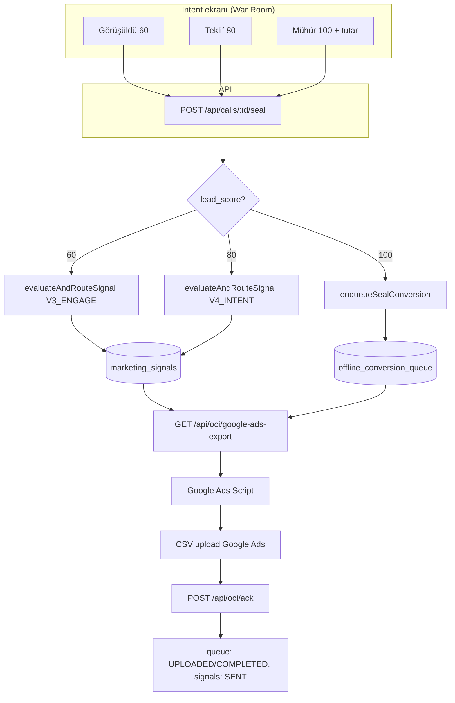

# Dönüşüm ↔ Intent Ekranı — Akış Şeması ve OCI Pipeline

**Tarih:** 2026-03-04  
**Amaç:** Intent ekranındaki butonlardan hangi dönüşümün tetiklendiği, atanan değerler, OCI pipeline (kuyruk → Script → Google Ads) ve cron/hata kontrolü.

---

## 1. Intent ekranı → Dönüşüm eşlemesi

| UI butonu / aksiyon | lead_score | Tetiklenen dönüşüm | Kaynak tablo | Google Ads conversion name |
|---------------------|------------|--------------------|--------------|----------------------------|
| **Operatör görüşüldü** (Görüşüldü) | 60 | V3 Nitelikli Görüşme | `marketing_signals` | `OpsMantik_V3_Nitelikli_Gorusme` |
| **Teklif** | 80 | V4 Sıcak Teklif | `marketing_signals` | `OpsMantik_V4_Sicak_Teklif` |
| **Mühür** (Satış tutarı + kaydet) | 100 | V5 Demir Mühür | `offline_conversion_queue` | `OpsMantik_V5_DEMIR_MUHUR` |

- **Görüşüldü / Teklif:** `POST /api/calls/[id]/seal` body: `{ lead_score: 60 | 80, currency: 'TRY' }`. Seal route call'ı günceller (status=confirmed, confirmed_at, lead_score); sonra **sadece** V3 veya V4 sinyalini `evaluateAndRouteSignal(gear, …)` ile `marketing_signals` tablosuna yazar. **Kuyruğa satır eklenmez.**
- **Mühür:** `SealModal` → `onConfirm(saleAmount, currency, 100, callerPhone)`. `POST /api/calls/[id]/seal` body: `{ lead_score: 100, sale_amount, currency }`. Call güncellenir; **sadece leadScore === 100** iken `enqueueSealConversion()` çağrılır → `offline_conversion_queue` INSERT. V5 için ayrıca V3/V4 emit edilmez (zaten mühür = nihai aşama).

**Kaynak (UI):** `components/dashboard/hunter-card.tsx` — Görüşüldü `score: 60`, Teklif `score: 80`; `components/dashboard/seal-modal.tsx` — Mühür `leadScore: 100`.

---

## 2. Atanan değerler (matematik)

| Gear | Değer formülü | Örnek (AOV=1000 TRY, gün≤3 decay=0.5) |
|------|----------------|----------------------------------------|
| V2 İlk Temas | AOV × pending(0.02) × decay | 1000×0.02×0.5 = **10 TRY** |
| V3 Nitelikli Görüşme | AOV × qualified(0.2) × decay | 1000×0.2×0.5 = **100 TRY** |
| V4 Sıcak Teklif | AOV × proposal(0.3) × decay | 1000×0.3×0.5 = **150 TRY** |
| V5 Demir Mühür | Operatörün girdiği `sale_amount` (veya site `oci_config` star/value) | Doğrudan satış tutarı (örn. 1500 TRY) |

- V2/V3/V4: `lib/domain/mizan-mantik/time-decay.ts` (decay), `value-config.ts` (floor), `orchestrator.ts` → `calculateSignalEV` + `getValueFloorCents`; floor yüzünden eskiden 100 TRY → 1000 TRY yazılabiliyordu (Muratcan/Eslamed floor düzeltmesi yapıldı).
- V5: `lib/oci/oci-config.ts` `computeConversionValue(star, saleAmount, config)`; `enqueue-seal-conversion.ts` ile kuyruğa `value_cents` yazılır.

---

## 3. Akış şeması — Girişten çıkışa

---

## 4. OCI pipeline — Veritabanı ve Script

1. **Kuyruk (V5):** `offline_conversion_queue` — status: QUEUED → (Script veya Worker tarafından) export edilir → PROCESSING/UPLOADED → ack sonrası COMPLETED.
2. **Sinyaller (V2/V3/V4):** `marketing_signals` — dispatch_status: PENDING. Export API hem kuyruk satırlarını hem PENDING sinyalleri döner; Script CSV’ye yazar; ack’te queue id’ler `queueIds`, signal id’ler (varsa) `skippedIds` veya ayrı mekanizma ile SENT işaretlenir.
3. **Export:** `GET /api/oci/google-ads-export?siteId=...&markAsExported=true` — Auth: Bearer session_token (verify handshake) veya x-api-key. Site UUID veya public_id. Dönüş: `{ id, orderId, gclid, wbraid, gbraid, conversionName, conversionTime, conversionValue, conversionCurrency, hashed_phone_number? }[]`.
4. **Script (Eslamed/Muratcan-OCI-Quantum.js):** verifyHandshake → fetchConversions (export URL) → Validator.analyze (click_id, time, value) → UploadEngine (Order ID, Google Click ID, Conversion name, time, value, currency, **Phone**) → upload.apply() → sendAck(successIds, skippedIds, pendingConfirmation=true).
5. **ACK:** `POST /api/oci/ack` — queue satırları UPLOADED/COMPLETED; `POST /api/oci/ack-failed` — FAILED, provider_error_code.

---

## 5. Çalışan cron’lar (OCI ile ilgili)

| Cron | Amaç | Dosya |
|------|------|--------|
| **enqueue-from-sales** | Son N saatteki confirmed sales’ları kuyruğa ekler (queue’da yoksa) | `app/api/cron/oci/enqueue-from-sales/route.ts` |
| **sweep-unsent-conversions** | oci_status=sealed ama kuyrukta olmayan call’ları `enqueueSealConversion()` ile kuyruğa alır (son 7 gün) | `app/api/cron/sweep-unsent-conversions/route.ts` |
| **attempt-cap** | attempt_count >= MAX_ATTEMPTS (varsayılan 5) olan kuyruk satırlarını FAILED yapar | `app/api/cron/oci/attempt-cap/route.ts` |
| **process-offline-conversions** | Worker (API) path: claim jobs, Google’a gönder, ack (oci_sync_method=api siteleri) | `app/api/cron/process-offline-conversions/route.ts` (veya workers) |

Script kullanan sitelerde gönderim **Google Ads Script tetikleyicisi** ile yapılır; worker cron’u sadece `oci_sync_method = 'api'` siteleri claim eder.

---

## 6. Hata kontrolü ve kör noktalar

- **Hata kontrolü:**  
  - Seal: enqueue hata verirse call `oci_status = 'FAILED_ENQUEUE'`; kullanıcıya "Seal saved but OCI enqueue failed" dönülür.  
  - Export: value_cents ≤ 0 satırlar export’a alınmaz, markAsExported ile işaretlenirse FAILED (VALUE_ZERO).  
  - Script: Validator (MISSING_CLICK_ID, INVALID_CLICK_ID_FORMAT, INVALID_TIME_FORMAT, INVALID_CONVERSION_VALUE, DETERMINISTIC_SKIP) → ack-failed.  
  - attempt-cap: Çok deneme sonrası FAILED (MAX_ATTEMPTS).

- **Kör noktalar / riskler:**  
  - **GCLID decode:** Google “GCLID’nin kodu çözülemedi” diyorsa Script CSV’de base64url (+ → -, / → _) kullanılıyor; telefon varsa Enhanced Conversions (Phone) ile eşleşme denenir.  
  - **Sinyal floor:** min_conversion_value_cents çok yüksekse (örn. 1000 TRY) hesaplanan V3 100 TRY floor’a çekilip 1000 yazılabiliyordu — site bazlı floor (örn. 50 TRY) ve mevcut sinyal düzeltme script’leri kullanıldı.  
  - **Çift kanal:** Aynı site hem API hem Script ile işlenmemeli (oci_sync_method: api vs script).  
  - **Poison pill:** confirmed_at geçmişe/geleceğe aşırı saparsa temporal sanity penceresi dışında enqueue reddedilir; runner’da hashed_phone eşlemesi rowIdToRow Map ile yapılır (poison sonrası indeks kayması riski kaldırıldı).

- **Belirsiz fonksiyonlar:**  
  - `apply_call_action_v1`: Seal/junk/cancel/restore için tek RPC; audit + revert snapshot. Detay DB migration’da.  
  - `oci_attempt_cap`: attempt_count’a göre FAILED işaretleyen RPC.  
  - Export’ta “blocked value zero” ve “pendingConfirmation” ile UPLOADED güncellemesi: Script’in ack’i beklenir; kalıcı COMPLETED için Google’dan onay/ikinci aşama gerekebilir (dokümantasyonda pendingConfirmation=true ile UPLOADED yazıldığı belirtilir).

- **Mantık hatası riski:**  
  - lead_score 60/80 iken kuyruğa satır eklenmemesi kasıtlı (sadece marketing_signals).  
  - lead_score 100 iken sale_amount = 0 ile mühür engellenir (API 400 döner).  
  - V3/V4 dedup: aynı call_id + google_conversion_name için tek sinyal (seal route’ta mevcut sinyal varsa tekrar emit edilmez).

---

## 7. Dönüşüm girişinden çıkışına çalışan fonksiyonlar (özet)

| Aşama | Fonksiyon / modül | Dosya |
|-------|--------------------|--------|
| UI tıklama | onQualify(60\|80), onSealConfirm(100) | hunter-card.tsx, seal-modal.tsx, use-queue-controller |
| Seal API | POST seal → apply_call_action_v1, V3/V4 emit, enqueueSealConversion | app/api/calls/[id]/seal/route.ts |
| V3/V4 sinyal | evaluateAndRouteSignal(gear, payload) | lib/domain/mizan-mantik/orchestrator.ts |
| V5 kuyruk | enqueueSealConversion(params) | lib/oci/enqueue-seal-conversion.ts |
| Değer (V2–V4) | getSiteValueConfig, calculateSignalEV, getValueFloorCents | value-config.ts, time-decay.ts, value-calculator.ts |
| Değer (V5) | computeConversionValue(star, saleAmount, config) | lib/oci/oci-config.ts |
| Export | GET google-ads-export → queue + marketing_signals, hashed_phone | app/api/oci/google-ads-export/route.ts |
| Script | QuantumClient.fetchConversions, Validator.analyze, UploadEngine.process | scripts/google-ads-oci/deploy/*-OCI-Quantum.js |
| ACK | POST /api/oci/ack, POST /api/oci/ack-failed | app/api/oci/ack/route.ts, ack-failed/route.ts |
| Cron | enqueue-from-sales, sweep-unsent-conversions, attempt-cap | app/api/cron/oci/*, app/api/cron/sweep-unsent-conversions |

Bu doküman, intent ekranı butonları → dönüşüm adı/değer → kuyruk/sinyal → export → Script → Google Ads ve ilgili cron/hata kontrolünü tek referansta toplar.
