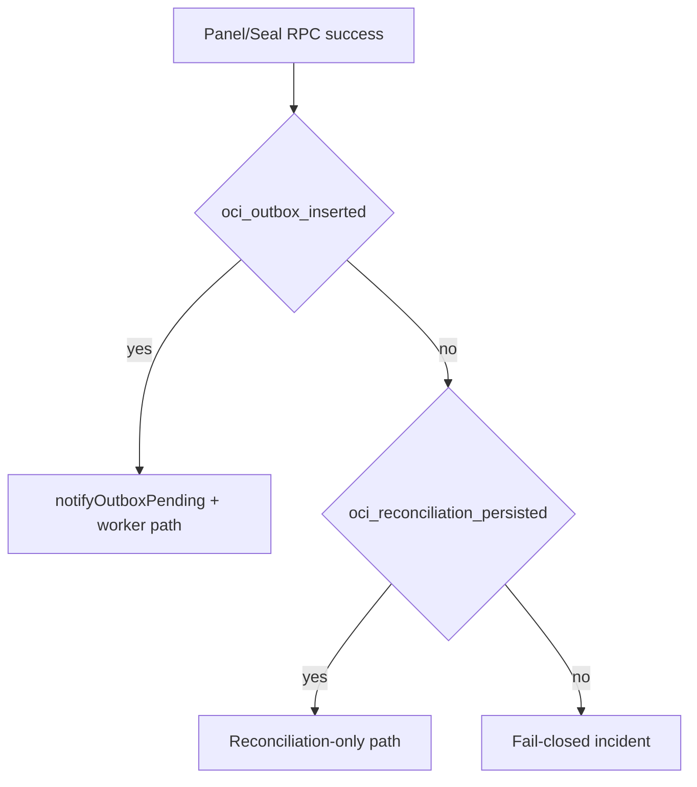
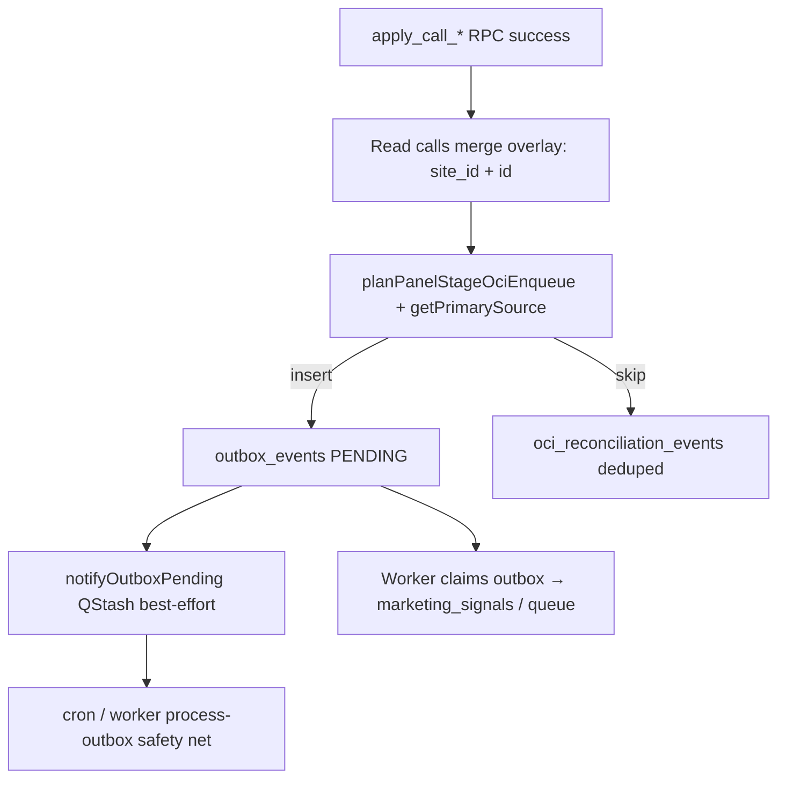

# OCI SSOT Troubleshooting (Faz4)

## Decision Flow

## PII Safety Rules

- Do not store raw phone, raw IP, full URL in reconciliation payload.
- Use hashes/truncated values for diagnostics.
- Treat payload sanitation regressions as release blockers.

## Cron timeout & sendability classification (L23 / L27)

- **`maxDuration`:** Every OCI / queue cron route declares `export const maxDuration` (see `tests/architecture/oci-cron-max-duration-l27.test.ts`). Heavy routes (`oci-maintenance`, `oci/sweep-zombies`, `oci/process-outbox-events`, `sweep-unsent-conversions`, `process-offline-conversions`, `oci/backfill-precursor-signals`) are pinned to **300 s**, well under their `CRON_LOCK_TTL_SEC`. Lightweight routes (delete sweeps, attempt-cap) use **60 s**.
- **Sendability transient errors:** `isTransientCallSendabilityError` (`lib/oci/call-sendability-fetch.ts`) classifies Postgres `40001 / 40P01 / 57014 / 55P03 / 08006`, PostgREST `5xx`, and network/timeout messages as **retryable**. Callers needing this contract should use `fetchCallSendabilityContextClassified` and branch on `kind`. Schema/permission errors are intentionally **not transient** to avoid retry loops.

## Tenant-safe ops endpoints (L30)

- **`GET /api/ops/stale-signals`**: requires **`requireCronAuth`** (same policy family as OCI crons). Without valid cron credentials you get **`403`** with `{"error":"forbidden","code":"CRON_FORBIDDEN"}`. For manual checks, call with **`Authorization: Bearer $CRON_SECRET`** (and in production hybrid mode, trusted Vercel cron provenance headers when applicable).
- **ACK receipt completion:** `complete_ack_receipt_v1` applies **`APPLIED`** only when **`id = receipt_id` AND `site_id` matches** the caller-supplied site (see migration `20261228141000_complete_ack_receipt_site_scope_v1.sql`).

## SLI / SLO definitions (L14)

Quantitative definitions and metric pointers: **[`OCI_SLI_SLO_REFERENCE.md`](./OCI_SLI_SLO_REFERENCE.md)**.

## Optional outbox pre-dedupe (Faz 6)

ADR: **[`../architecture/OCI_OUTBOX_PREDEDUPE_OPTIONAL_ADR.md`](../architecture/OCI_OUTBOX_PREDEDUPE_OPTIONAL_ADR.md)**.

## Required Response Fields

- `oci_outbox_inserted`
- `oci_reconciliation_persisted`
- `oci_reconciliation_reason`
- `oci_enqueue_ok`
# OCI SSOT troubleshooting

**Preflight + matematik:** [`docs/OPS/OCI_CONVERSION_MATH_AND_PREFLIGHT.md`](../OPS/OCI_CONVERSION_MATH_AND_PREFLIGHT.md) — invariant’lar, claim filtresi, backfill zaman kuralları, deploy checklist.

Follow this order when conversions look wrong in Google Ads or in OpsMantik OCI Control.

## 1. Click ID on the call

- Confirm the sealed call has a usable `gclid`, `wbraid`, or `gbraid` (direct session or stitch). Without a click ID, **won** never enters `offline_conversion_queue`, and **marketing_signals** upserts skip with canonical reason `NO_ADS_CLICK_ID` (recorded in `oci_reconciliation_events` when applicable; legacy label `missing_click_ids` may appear in older telemetry).
- Panel mutations follow a strict producer identity: each successful HTTP mutation should end with **`oci_enqueue_ok: true`** in the panel JSON (when the route exposes OCI fields): that means either a new `outbox_events` **PENDING** row (`oci_outbox_inserted: true`) **or** a durable `oci_reconciliation_events` row (`oci_reconciliation_persisted: true`, including idempotent duplicate / `23505`). **`oci_reconciliation_reason`** is the canonical skip/audit reason when no outbox row was inserted (`null` when `oci_outbox_inserted: true`). If `oci_enqueue_ok: false`, neither artifact landed — treat as operator-visible failure (metrics: `panel_stage_oci_producer_incomplete_total`, `panel_stage_outbox_insert_failed_total` on insert errors, `panel_stage_reconciliation_persist_failed_total` on audit append errors).
- **`queued`** on panel routes now tracks **IntentSealed outbox insert** (`oci_outbox_inserted`), not “notify fired”; background notify may still run for other pending rows.
- Reconciliation reasons from the producer include: `MERGED_CALL`, `NO_EXPORTABLE_OCI_STAGE` (legacy telemetry may still say `NOT_EXPORTABLE_STAGE`), `NO_MATCHED_SESSION`, `SESSION_NOT_FOUND`, `NO_ADS_CLICK_ID`, `TEST_CLICK_ID`, `OUTBOX_INSERT_FAILED`.
- After RPC, the producer overlays **`merged_into_call_id`** (and empty `matched_session_id`) from `calls` because RPC payloads may omit merge fields.

## 2. Precursor marketing signals (ordering)

- **OpsMantik_Won** journal rows stay **`BLOCKED_PRECEDING_SIGNALS`** until precursors are non-blocking. The gate checks **both** `marketing_signals` (`hasBlockingPrecedingMarketingSignals`) **and** journal micro-stages for contacted/offered (`hasBlockingPrecedingJournalMicroStages`) — see `lib/oci/preceding-signals.ts` (`hasBlockingPrecedingExports`).
- **Legacy / parallel lane:** **OpsMantik_Contacted** and **OpsMantik_Offered** rows in `marketing_signals` must leave blocking dispatch states (`PENDING`, `PROCESSING`, `STALLED_FOR_HUMAN_AUDIT`) when those rows exist for the call.
- Historically missing signals use **`planPrecursorBackfillStages`** (`lib/oci/precursor-backfill-plan.ts`): **ledger** time per stage when present; if the ledger has *some* events but not every stage required by `calls.status`, missing stages use **hybrid** (`call_snapshot_hybrid`) with `confirmed_at` / `created_at` — not job `NOW()`; if the ledger is **empty** for the call, **full fallback** (`call_snapshot_fallback`). Conversion time is never the backfill job’s wall-clock `NOW()`.
- If precursors are still blocking, the won row stays in **`BLOCKED_PRECEDING_SIGNALS`** with `block_reason` set (for example `PRECEDING_SIGNALS_NOT_EXPORTED`).
- Cron **`/api/cron/oci/promote-blocked-queue`** promotes blocked rows to **`QUEUED`** when precursors are ready (ledger-safe transition).

## 3. Export queue vs script/API fetch

- Script/API export only pulls **`offline_conversion_queue`** rows in **`QUEUED`** or **`RETRY`**.
- **`BLOCKED_PRECEDING_SIGNALS`** is intentionally excluded until promotion.

## 4. `marketing_signals` table (ops / audit — not the Script GET batch)

- `GET /api/oci/google-ads-export` does **not** read this table. Pending rows use `marketing_signals.dispatch_status = 'PENDING'` until separate maintenance/ack paths move them. For visibility: OCI Control **Signals PENDING** and **`GET /api/oci/queue-stats`** dispatch breakdown.

## 5. ACK and terminal states

- After upload, ACK routes move rows to **`COMPLETED`** / signal **`SENT`**. Failed ACK paths mark **`FAILED`** / **`COMPLETED_UNVERIFIED`** per existing contracts.

## 6. Drain path and lock behavior

- Deterministic manual drain should target **worker path**: `POST /api/workers/oci/process-outbox` with `Authorization: Bearer CRON_SECRET` and `x-opsmantik-internal-worker: 1`.
- Cron endpoint (`/api/cron/oci/process-outbox-events`) remains safety net. `lock_held` there is expected when another run owns the lock; for deterministic drain use worker-first scripts.

## SSOT tables (mental model)

| Concern | Primary table |
|--------|----------------|
| Won conversion payload & export ordering | `offline_conversion_queue` |
| Stage-level conversions (contacted/offered) | `marketing_signals` |
| Skip / audit for SSOT gaps | `oci_reconciliation_events` |
| Funnel timeline (contacted/offered/won events) | `call_funnel_ledger` |
| Queue row transitions / snapshot | `oci_queue_transitions` + `apply_snapshot_batch` |

## Useful endpoints (authenticated)

- `GET /api/oci/queue-stats?siteId=...` — queue totals, stuck processing, signal dispatch breakdown, oldest blocked timestamp.
- `GET /api/oci/export-coverage?siteId=...` — compact SSOT snapshot + reconciliation event volume (24h).
- `GET /api/oci/export-coverage?siteId=...&window=last_1h|last_24h|last_7d` — reconciliation reason distribution by time window.

## Operational cron (secured)

- `GET /api/cron/oci/promote-blocked-queue` — promote blocked won rows when precursors are ready.
- `GET /api/cron/oci/backfill-precursor-signals?siteId=...&limit=50&dry_run=1` — optional gap fill for missing contacted/offered signals (dry-run first).

---

## Panel mutation vs OCI artifact (decision tree)

“RPC 200” does not imply Google received a conversion. Use the HTTP body and DB rows.

**L15 — Order:** routes call `enqueuePanelStageOciOutbox` **before** `notifyOutboxPending`. If outbox insert fails, notify still runs (cron may process other PENDING rows); do not assume notify implies this call was queued.

**L15 — Single-request insert retry:** `enqueuePanelStageOciOutbox` performs at most **two** insert attempts on the same HTTP request. The **second** attempt runs only when the first error is a **transient** Postgres code (`40001` deadlock, `40P01` deadlock_detected, `57014` query_canceled, `55P03` lock_not_available, `08006` connection_failure). Any other failure (including `23505` unique violations) does **not** get an automatic retry — rely on idempotent client replay or operator follow-up.

**L15 — `request_id` on outbox row:** Panel routes pass `requestId` into `enqueuePanelStageOciOutbox`; when set, `outbox_events.payload.request_id` is populated so Vercel/request logs can be joined to the exact PENDING row (see [`OCI_EXPORT_AND_TRACE_CORRELATION_ADR.md`](../architecture/OCI_EXPORT_AND_TRACE_CORRELATION_ADR.md)).

---

## Reconciliation payload — PII hygiene (L6b)

Do **not** put phone numbers, raw IP, full landing URLs, or free-form user notes into `oci_reconciliation_events.payload`. Prefer: `call_id`, `site_id`, short reason codes, `merged_into_call_id` UUIDs, truncated error tokens. `OUTBOX_INSERT_FAILED` may include Postgres message text — keep operator-facing only; escalate scrubbing if GDPR-sensitive strings appear.

---

## Observability SLIs (L14 — definitions only)

| SLI | Source | Notes |
|-----|--------|--------|
| `outbox_pending_age` | `GET /api/admin/metrics` → `outbox.pending_max_age_seconds` | Oldest PENDING `outbox_events.created_at` vs snapshot time |
| `outbox_pending_count` | same → `outbox.pending` | Raw backlog |
| `notify_publish_fail` | refactor metric `oci_notify_outbox_publish_failed_total` | QStash publish threw after enqueue |
| `producer_incomplete` | `panel_stage_oci_producer_incomplete_total` | Neither outbox insert nor reconciliation audit persisted |
| `reconciliation_persist_fail` | `panel_stage_reconciliation_persist_failed_total` | Audit append threw (non-23505) |

SLO numeric targets are a product/ops decision; use the above for dashboards and alarms. **Dashboards:** ingest `GET /api/admin/metrics` JSON for outbox backlog/age; pair with Upstash / refactor counters for producer + notify failures.

---

## Producer vs worker — reason ownership

| Reason / situation | Panel producer (`enqueuePanelStageOciOutbox`) | Outbox worker (`process-outbox`) |
|--------------------|-----------------------------------------------|-----------------------------------|
| `MERGED_CALL`, `NO_EXPORTABLE_OCI_STAGE`, `NO_MATCHED_SESSION`, `NO_ADS_CLICK_ID`, `TEST_CLICK_ID` | Yes — reconciliation row | May also write reconciliation on contract violations |
| `SESSION_NOT_FOUND` | **Not** emitted by current producer paths | Possible when session row missing during worker read |
| `OUTBOX_INSERT_FAILED` | Yes — after failed `outbox_events` insert | No |
| Dedupe `23505` on `oci_reconciliation_events` | Treated as persisted audit (idempotent) | Same pattern on worker-side inserts |

---

## Intent precursor env (`OCI_INTENT_PANEL_PRECURSOR_CONTACTED_ENABLED`) — L5

- **Default off** in production until marketing agrees on Google funnel ordering (precursor contacted before won/offered in the wild).
- **Canary:** enable on a single staging site or one production `site_id` via env split if you add routing; otherwise global env toggles all tenants.
- **Rollback:** set to `false` / unset and redeploy; existing `marketing_signals` / outbox rows are not deleted.
- **Scope:** panel-only path (`intent` + valid Ads click → payload stage `contacted`); sync/ingest remains unchanged by design.

---

## Staging chaos — quick checks (L8)

| Scenario | What to do | Pass signal |
|----------|------------|--------------|
| QStash unavailable | Block outbound to QStash or wrong signing secret | `outbox.pending_max_age_seconds` stays within SLO; cron/worker drains |
| Cron auth broken | Wrong `CRON_SECRET` on cron URL | PENDING grows; `outbox.pending` alarm fires |
| Burst stage clicks | Script many stage POSTs in 1s | Dedup bucket limits notify spam; worker eventually consistent |

---

## DR / PITR (L20)

See **[`OCI_DISASTER_RECOVERY_DB.md`](./OCI_DISASTER_RECOVERY_DB.md)** for restore principles and incident triggers. Supabase PITR / branch steps stay in your org-wide DR runbook.

---

## Marketing consent vs signals (L21)

Workshop checklist and decision capture: **[`../OPS/OCI_CONSENT_POSTURE_WORKSHOP.md`](../OPS/OCI_CONSENT_POSTURE_WORKSHOP.md)**. Seal path consent: `enqueueSealConversion` / `hasMarketingConsentForCall`; panel producer rules remain product+legal sign-off.

---

## Optional canary: primary double-read (L18)

Set `OCI_PRODUCER_PRIMARY_RECHECK=1` to run a second `getPrimarySource` immediately after planning an insert. If Ads click presence flips between reads, `oci_producer_primary_window_drift_total` increments — investigate session/write races or replica lag.

**Deferred (full L18 shadow):** fire-and-forget comparison of producer plan vs worker `getPrimarySource` on the same request (with metric e.g. `oci_producer_worker_primary_mismatch_total`) is **not** shipped — cost and async coupling; use drift metric + staging load tests first.

---

## Adjustment anchoring (T10-10)

`POST /api/oci/adjustments` requires an **original terminal-success** queue row (`COMPLETED` / `UPLOADED` / `COMPLETED_UNVERIFIED`) for the supplied `orderId`. Without it the route returns **422 `ADJUSTMENT_NO_ANCHOR`** and the operator must either fix the anchor or supply **`x-opsmantik-adjustment-override: 1`** to bypass — the override is recorded as `[OVERRIDE_NO_ANCHOR]` in `conversion_adjustments.reason` for audit.

## Fast-path claim ownership (T10-11)

`processSingleOciExport` (Value-Lane) rejects any row whose `claimed_by` is **not** `FASTPATH_OCI_EXPORT`. A cron / sweep claim is **off-limits** for the value lane; mismatched rows increment `fastpath_claim_owner_mismatch_total` and return `FASTPATH_CLAIM_OWNER_MISMATCH`.

## Schema dumps are non-authoritative (T10-2)

`schema.sql` / `schema_utf8.sql` / `supabase/schema.sql` open with a `NON-AUTHORITATIVE SNAPSHOT` banner. Schema review, security audits and release gates must cite the migration chain in `supabase/migrations/` (applied via Cursor Supabase MCP). Pin: `tests/architecture/schema-dump-non-authoritative-t10-2.test.ts`.
